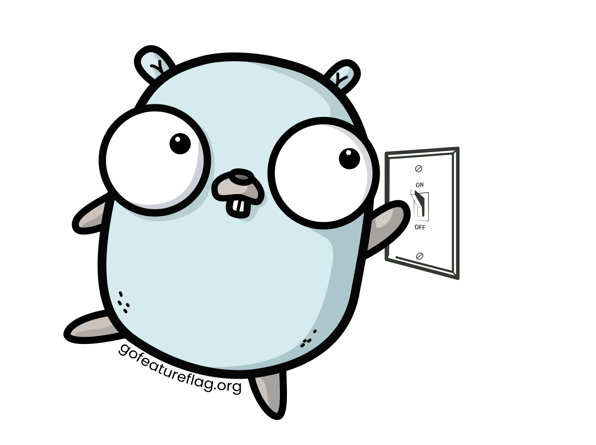

<p align="center">
  <a href="https://gofeatureflag.org" target="_blank"></a>
  <!-- <a href="https://gofeatureflag.org" target="_blank"></a> -->
</p>

# 🎛️ GO Feature Flag

<p align="center">
    <a href="https://github.com/thomaspoignant/go-feature-flag/actions/workflows/ci.yml"></a>
    <a href="https://scorecard.dev/viewer/?uri=github.com/thomaspoignant/go-feature-flag"></a>
    <a href="https://codecov.io/gh/thomaspoignant/go-feature-flag"></a>
    <a href="https://sonarcloud.io/dashboard?id=thomaspoignant_go-feature-flag"></a>
    <a href="https://github.com/thomaspoignant/go-feature-flag/releases"></a>
    <a href="https://goreportcard.com/report/github.com/thomaspoignant/go-feature-flag"></a>
    <a href="https://github.com/thomaspoignant/go-feature-flag/blob/main/LICENSE"></a>
    <br/>
    <a href="https://www.bestpractices.dev/projects/6290"></a>
    <a href="https://pkg.go.dev/github.com/thomaspoignant/go-feature-flag"></a>
    
    <a href="https://github.com/avelino/awesome-go/#server-applications"></a>
    <a href="https://gofeatureflag.org/slack"></a>
    <a href="https://github.com/sponsors/thomaspoignant"></a>
    <br />
    <a href="https://gofeatureflag.org">GO Feature Flag is a simple, complete and lightweight self-hosted feature flag solution 100% Open Source.</a>
</p>

> :pray: If you are using **GO Feature Flag** please consider to add yourself in the [adopters](./ADOPTERS.md) list.  
> This simple act significantly boosts the project's visibility and credibility, making a substantial contribution to its advancement.
> 
> If you want to support me and GO Feature Flag, you can also [become a sponsor](https://github.com/sponsors/thomaspoignant).

## Table of Contents

- [🎛️ GO Feature Flag](#️-go-feature-flag)
  - [What is GO Feature Flag?](#what-is-go-feature-flag)
  - [What can I do with GO Feature Flag?](#what-can-i-do-with-go-feature-flag)
  - [Getting started with GO Feature Flag](#getting-started)
  - [Can I use GO Feature Flag with any language?](#can-i-use-go-feature-flag-with-any-language)
  - [Where do I store my flags file?](#where-do-i-store-my-flags-file)
  - [Flags file format](#flags-file-format)
  - [Rule format](#rule-format)
  - [Evaluation Context](#evaluation-context)
  - [Variations](#variations)
  - [Rollout](#rollout)
    - [Complex rollout strategy available](#complex-rollout-strategy-available)
  - [Notifiers](#notifiers)
  - [Export data](#export-data)
  - [Linter](#linter)
- [How can I contribute?](#how-can-i-contribute)
  - [Contributors](#contributors)
  - [Sponsors](#sponsors)
  - [Adopters](#adopters)

## What is GO Feature Flag?

GO Feature Flag is a lightweight and open-source solution that provides a simple and complete feature flag implementation.

The solution has been built to facilitate the usage of feature flags in your code with the easiest setup possible.

Originally, **GO Feature Flag** was designed as a solution exclusively for the `GO` language. With the new standardization of feature flags by the [Openfeature](https://openfeature.dev/) project, the solution is now available for multiple languages _([list of supported languages](https://gofeatureflag.org/docs/sdk))_ through a simple API server called the relay proxy, which can be hosted.

> [!TIP]
> If you are not familiar with feature flags, I've written an [article](https://medium.com/better-programming/feature-flags-and-how-to-iterate-quickly-7e3371b9986) which explains why feature flags can fasten your iteration cycle.

## What can I do with GO Feature Flag?

- Storing your configuration flags file on various locations (`HTTP`, `S3`, `Kubernetes`, [_see full list_](https://gofeatureflag.org/docs/configure_flag/store_your_flags)).
- Configuring your flags in various [format](https://gofeatureflag.org/docs/configure_flag/flag_format) (`JSON`, `TOML` and `YAML`).
- Adding complex [rules](https://gofeatureflag.org/docs/configure_flag/target-with-flags) to target your users.
- Use a complex rollout strategy for your flags :
  - [Run A/B testing experimentation](https://gofeatureflag.org/docs/configure_flag/rollout-strategies/experimentation).
  - [Progressively rollout a feature](https://gofeatureflag.org/docs/configure_flag/rollout-strategies/progressive).
  - [Schedule your flag updates](https://gofeatureflag.org/docs/configure_flag/rollout-strategies/scheduled).
- Exporting your flags usage data to various destinations such as _(`S3`, `Google cloud storage`, `file`, `kubernetes`, see the [_full list_](https://gofeatureflag.org/docs/integrations/store-flags-configuration#available-retrievers))_.
- Getting notified when a flag has been changed _(`webhook` and `slack`)_.
- Use **GO Feature Flag** in several languages with **Open Feature SDKs**.
- Support your full stack, from the backend to the frontend including your mobile apps.

https://github.com/user-attachments/assets/56e1a2a2-996f-4db8-9c93-28c057e4ed5a

_The code of this demo is available in [`examples/demo`](examples/demo) repository_.

## Getting started

> [!IMPORTANT]
> Before starting to use **GO Feature Flag** you should decide
> if you want to use Open Feature SDKs or if you want to use GO Feature Flag as a GO Module.
> 
> We recommend using the relay-proxy for a central flag management and evaluation solution,
> it enables the multi-languages support, and it integrates seamlessly with the Open Feature SDKs.  
> This is the best way to get full potential of GO Feature Flag.
> 
> If your project is exclusively in GO, the GO module is an option. It will perform the flag evaluation directly in your GO code.

<a id="using-open-feature"></a>
<details>
<summary><b>Using Open Feature SDKs</b></summary>

### Create a feature flag configuration

Create a new `YAML` file containing your first flag configuration.

```yaml title="flag-config.yaml"
# 20% of the users will use the variation "my-new-feature"
test-flag:
  variations:
    my-new-feature: true
    my-old-feature: false
  defaultRule:
    percentage:
      my-new-feature: 20
      my-old-feature: 80
```

This flag split the usage of this flag, 20% will use the variation `my-new-feature` and 80% the variation `my-old-feature`.

### Create a relay proxy configuration file

Create a new `YAML` file containing the configuration of your relay proxy.

```yaml title="goff-proxy.yaml"
listen: 1031
pollingInterval: 1000
startWithRetrieverError: false
retriever:
  kind: file
  path: /goff/flag-config.yaml
exporter:
  kind: log
```

### Install the relay proxy

And we will run the **relay proxy** locally to make the API available.  
The default port will be `1031`.

```shell
# Launch the container
docker run \
  -p 1031:1031 \
  -v $(pwd)/flag-config.yaml:/goff/flag-config.yaml \
  -v $(pwd)/goff-proxy.yaml:/goff/goff-proxy.yaml \
  gofeatureflag/go-feature-flag:latest

```

_If you don't want to use docker to install the **relay proxy** you can follow other ways to install it in the [documentation](https://gofeatureflag.org/docs/relay-proxy/install_relay_proxy)._

### Use Open Feature SDK

_In this example, we are using the **nodejs SDK**, but you can check other languages [here](https://gofeatureflag.org/docs/sdk)._


#### Install dependencies

```shell
npm i @openfeature/server-sdk @openfeature/go-feature-flag-provider
```

#### Init your Open Feature client

In your app initialization, you have to create a client using the Open Feature SDK and initialize it.

```javascript
const {OpenFeature} = require("@openfeature/server-sdk");
const {GoFeatureFlagProvider} = require("@openfeature/go-feature-flag-provider");


// init Open Feature SDK with GO Feature Flag provider
const goFeatureFlagProvider = new GoFeatureFlagProvider({
  endpoint: 'http://localhost:1031/' // DNS of your instance of relay proxy
});
OpenFeature.setProvider(goFeatureFlagProvider);
const featureFlagClient = OpenFeature.getClient('my-app')
```

#### Evaluate your flag

Now you can evaluate your flags anywhere in your code using this client.

```javascript
// Context of your flag evaluation.
// With GO Feature Flag you MUST provide a targetingKey that is a unique identifier of the user.
const evaluationContext = {
  targetingKey: '1d1b9238-2591-4a47-94cf-d2bc080892f1', // user unique identifier (mandatory)
  firstname: 'john',
  lastname: 'doe',
  email: 'john.doe@gofeatureflag.org',
  admin: true, // this field is used in the targeting rule of the flag "flag-only-for-admin"
  // ...
};

const adminFlag = await featureFlagClient.getBooleanValue('flag-only-for-admin', false, evaluationContext);
if (adminFlag) {
  // flag "flag-only-for-admin" is true for the user
  console.log("new feature");
} else {
  // flag "flag-only-for-admin" is false for the user
}
```

</details>

<a id="using-go-module"></a>
<details>
<summary><b>Using the GO Module</b></summary>

### Installation
```bash
go get github.com/thomaspoignant/go-feature-flag
```

### Create a feature flag configuration

Create a new `YAML` file containing your first flag configuration.

```yaml title="flag-config.yaml"
# 20% of the users will use the variation "my-new-feature"
test-flag:
  variations:
    my-new-feature: true
    my-old-feature: false
  defaultRule:
    percentage:
      my-new-feature: 20
      my-old-feature: 80
```

This flag split the usage of this flag, 20% will use the variation `my-new-feature` and 80% the variation `my-old-feature`.

### SDK Initialisation
First, you need to initialize the `ffclient` with the location of your backend file.
```go linenums="1"
err := ffclient.Init(ffclient.Config{
  PollingInterval: 3 * time.Second,
  Retriever:      &fileretriever.Retriever{
    Path: "flag-config.goff.yaml",
  },
})
defer ffclient.Close()
```
*This example will load a file from your local computer and will refresh the flags every 3 seconds (if you omit the
PollingInterval, the default value is 60 seconds).*

> ℹ info  
This is a basic configuration to test locally, in production it is better to use a remote place to store your feature flag configuration file.  
Look at the list of available options in the [**Store your feature flag file** page](https://gofeatureflag.org/docs/integrations/store-flags-configuration#available-retrievers).

### Evaluate your flags
Now you can evaluate your flags anywhere in your code.

```go linenums="1"
user := ffcontext.NewEvaluationContext("user-unique-key")
hasFlag, _ := ffclient.BoolVariation("test-flag", user, false)
if hasFlag {
  // flag "test-flag" is true for the user
} else {
  // flag "test-flag" is false for the user
}
```
The full documentation is available on https://docs.gofeatureflag.org  
You can find more examples in the [examples/](https://github.com/thomaspoignant/go-feature-flag/tree/main/examples) directory.

</details>

## Can I use GO Feature Flag with any language?

Originally GO Feature Flag was built to be a GOlang only library, but it limits the ecosystem too much.  
To be compatible with more languages we have implemented the [GO Feature Flag Relay Proxy](cmd/relayproxy/).
It is a service you can host that provides an API to evaluate your flags, you can call it using HTTP to get your variation.

Since we believe in standardization we are also implementing [OpenFeature](https://github.com/open-feature) providers to interact with this API in the language of your choice.  
_(OpenFeature is still at an early stage, so not all languages are supported and expect some changes in the future)_

For now, we have providers for:

| Language                       | Provider Source                                                                                                               | Version                                                                                                                                                                                                                                                                                                                                   |
|--------------------------------|-------------------------------------------------------------------------------------------------------------------------------|-------------------------------------------------------------------------------------------------------------------------------------------------------------------------------------------------------------------------------------------------------------------------------------------------------------------------------------------|
| Go                             | [Go Provider](https://github.com/open-feature/go-sdk-contrib/tree/main/providers/go-feature-flag)                             | [](https://github.com/open-feature/go-sdk-contrib/tree/main/providers/go-feature-flag) |
| Java / Kotlin (server)         | [Java Provider](https://github.com/open-feature/java-sdk-contrib/tree/main/providers/go-feature-flag)                         | [](https://central.sonatype.com/artifact/dev.openfeature.contrib.providers/go-feature-flag)                                                                                                    |
| Android / Kotlin (client)      | [Kotlin Provider](openfeature/providers/kotlin-provider)                                                                      | [](https://central.sonatype.com/artifact/org.gofeatureflag.openfeature/gofeatureflag-kotlin-provider)                                                                             |                                                                                                    
| Javascript/Typescript (server) | [Server Provider](https://github.com/open-feature/js-sdk-contrib/tree/main/libs/providers/go-feature-flag)                    | [](https://www.npmjs.com/package/@openfeature/go-feature-flag-provider)                                                                                                                                           |
| Javascript/Typescript (client) | [Client Provider](https://github.com/open-feature/js-sdk-contrib/tree/main/libs/providers/go-feature-flag-web)                | [](https://www.npmjs.com/package/@openfeature/go-feature-flag-web-provider)                                                                                                                                   |
| Python                         | [Python Provider](openfeature/providers/python-provider)                                                                      | [](https://pypi.org/project/gofeatureflag-python-provider/)                                                                                                                                                                 |
| .Net                           | [.Net Provider](https://github.com/open-feature/dotnet-sdk-contrib/tree/main/src/OpenFeature.Contrib.Providers.GOFeatureFlag) | [](https://nuget.info/packages/OpenFeature.Contrib.GOFeatureFlag)                                                                                                                                                     |
| Ruby                           | [Ruby Provider](https://github.com/open-feature/ruby-sdk-contrib/tree/main/providers/openfeature-go-feature-flag-provider)    | [](https://rubygems.org/gems/openfeature-go-feature-flag-provider)                                                                                                                                                    |
| Swift                          | [Swift Provider](https://github.com/go-feature-flag/openfeature-swift-provider)                                               | [](https://github.com/go-feature-flag/openfeature-swift-provider)                                                                                                             |
| PHP                            | [PHP Provider](https://github.com/open-feature/php-sdk-contrib/tree/main/providers/GoFeatureFlag)                             | [](https://packagist.org/packages/open-feature/go-feature-flag-provider)                                                                                                                                                 |
                                                                                                                                                                                                                                        

## Where do I store my flags file?

The module supports different ways of retrieving the flag file.  
The available retrievers are:
- **GitHub**
- **GitLab**
- **HTTP endpoint**
- **AWS S3**
- **Local file**
- **Google Cloud Storage**
- **Kubernetes ConfigMaps**
- **MongoDB**
- **Redis**
- **BitBucket**
- **AzBlobStorage**
- ...

_[See the full list and more information.](https://gofeatureflag.org/docs/integrations/store-flags-configuration#available-retrievers)_

## Flags file format
**GO Feature Flag** core feature is to centralize all your feature flags in a single file and to avoid hosting and maintaining a backend server to manage them.

Your file should be a `YAML`, `JSON` or `TOML` file with a list of flags *(examples: [`YAML`](testdata/flag-config.yaml), [`JSON`](testdata/flag-config.json), [`TOML`](testdata/flag-config.toml))*.

The easiest way to create your configuration file is to use **GO Feature Flag Editor** available at https://editor.gofeatureflag.org.  
If you prefer to do it manually please follow the instruction below.

**A flag configuration looks like this:**

<details open>
<summary>YAML</summary>

```yaml
# This is your configuration for your first flag
first-flag:
  variations: # All possible return value for your feature flag
    A: false
    B: true
  targeting: # If you want to target a subset of your users in particular
    - query: key eq "random-key"
      percentage:
        A: 0
        B: 100
  defaultRule: # When no targeting match we use the defaultRule
    variation: A

# A second example of a flag configuration
second-flag:
  variations:
    A: "valueA"
    B: "valueB"
    defaultValue: "a default value"
  targeting:
    - name: notkey_rule
      query: key eq "not-a-key"
      percentage:
        A: 10
        B: 90
  defaultRule:
    variation: defaultValue
  version: "12"
  experimentation:
    start: 2021-03-20T00:00:00.1-05:00
    end: 2021-03-21T00:00:00.1-05:00
```
</details>
<details>
<summary>JSON</summary>

```json
{
  "first-flag": {
    "variations": {
      "A": false,
      "B": true
    },
    "targeting": [
      {
        "query": "key eq \"random-key\"",
        "percentage": {
          "A": 0,
          "B": 100
        }
      }
    ],
    "defaultRule": {
      "variation": "A"
    }
  },

  "second-flag": {
    "variations": {
      "A": "valueA",
      "B": "valueB",
      "defaultValue": "a default value"
    },
    "targeting": [
      {
        "name": "notkey_rule",
        "query": "key eq \"not-a-key\"",
        "percentage": {
          "A": 10,
          "B": 90
        }
      }
    ],
    "defaultRule": {
      "variation": "defaultValue"
    },
    "version": "12",
    "experimentation": {
      "start": "2021-03-20T05:00:00.100Z",
      "end": "2021-03-21T05:00:00.100Z"
    }
  }
}
```

</details>

<details>
<summary>TOML</summary>

```toml
[first-flag.variations]
A = false
B = true

[[first-flag.targeting]]
query = 'key eq "random-key"'

[first-flag.targeting.percentage]
A = 0
B = 100

[first-flag.defaultRule]
variation = "A"

[second-flag]
version = "12"

[second-flag.variations]
A = "valueA"
B = "valueB"
defaultValue = "a default value"

[[second-flag.targeting]]
name = "notkey_rule"
query = 'key eq "not-a-key"'

[second-flag.targeting.percentage]
A = 10
B = 90

[second-flag.defaultRule]
variation = "defaultValue"

[second-flag.experimentation]
start = 2021-03-20T05:00:00.100Z
end = 2021-03-21T05:00:00.100Z
```

</details>

For detailed information on the fields required to create a flag, please refer to the [documentation](https://gofeatureflag.org/docs/configure_flag/create-flags).

## Rule format

The query format is based on the [`nikunjy/rules`](https://github.com/nikunjy/rules) library.

All the operations can be written in capitalized or lowercase (ex: `eq` or `EQ` can be used).  
Logical Operations supported are `AND` `OR`.

Compare Expression and their definitions (`a|b` means you can use either one of the two `a` or `b`):

```
eq|==: equals to 
ne|!=: not equals to
lt|<: less than 
gt|>: greater than
le|<=: less than equal to
ge|>=: greater than equal to 
co: contains 
sw: starts with 
ew: ends with
in: in a list
pr: present
not: not of a logical expression
```
### Examples

- Select a specific user: `key eq "example@example.com"`
- Select all identified users: `anonymous ne true`
- Select a user with a custom property: `userId eq "12345"`

## Evaluation Context
An evaluation context in a feature flagging system is crucial for determining the output of a feature flag evaluation. It's a collection of pertinent data about the conditions under which the evaluation is being made. This data can be supplied through a mix of static information _(server name, IP, etc ...)_ and dynamic inputs (information about the user performing the action, etc ...), along with state information that is implicitly carried through the execution of the program.

When using GO Feature Flag, it's often necessary to personalize the experience for different users. This is where the concept of a **targeting key** comes into play. A targeting key is a unique identifier that represents the context of the evaluation _(email, session id, a fingerprint or anything that is consistent)_, ensuring that they are consistently exposed to the same variation of a feature, even across multiple visits or sessions.

For instance, GO Feature Flag ensures that in cases where a feature is being rolled out to a percentage of users, based on the targeting key, they will see the same variation each time they encounter the feature flag.

The targeting key is a fundamental part of the evaluation context because it directly affects the determination of which feature variant is served to a particular user, and it maintains that continuity over time. To do so GO Feature Flag to do a hash to define if the flag can apply to this evaluation context or not.  
**We recommend using a hash if possible.**   

Feature flag targeting and rollouts are all determined by the user you pass to your evaluation calls.

## Custom bucketing

In some cases, you might need to _bucket_ users based on a different key, e.g. a `teamId`, so that users within the same team get exposed to the same flag variation and get a consistent experience.

This can be achieved by defining the `bucketingKey` field in the flag configuration. When present, the value corresponding to the `bucketingKey` will be extracted from the attributes, and that value used for hashing and determining the outcome in place of the `targetingKey`.

## Variations
Variations are the different values possible for a feature flag.  
GO Feature Flag can manage more than just `boolean` values; the value of your flag can be any of the following types:
- `bool`
- `int`
- `float`
- `string`
- `json array`
- `json object`

### Example
```java
Boolean result = featureFlagClient.getBooleanValue("your.feature.key", false, userContext);

// this example is using the java SDK
// result is now true or false depending on the setting of this boolean feature flag
```
Variation methods take the feature **flag key**, an **evaluation context**, and a **default value**.

**Why do we need a default value?** If we have any error during the evaluation of the flag, we will return the default value, you will always get a value return from the function and we will never throw an error.

In the example, if the flag `your.feature.key` does not exist, the result will be `false`.  
Note that the result will always provide a usable value.

## Rollout

A critical part of every new feature release is orchestrating the actual launch schedule between the Product, Engineering, and Marketing teams.

Delivering powerful user experiences typically requires software teams to manage complex releases and make manual updates at inconvenient times.

But it does not have to, having a complex **rollout** strategy allows you to have a lifecycle for your flags.

### Complex rollout strategy available

- [Percentages rollout](https://gofeatureflag.org/docs/configure_flag/rollout-strategies/percentage) - impact randomly a subset of your users.
- [Progressive rollout](https://gofeatureflag.org/docs/configure_flag/rollout-strategies/progressive) - increase the percentage of your flag over time.
- [Scheduled rollout](https://gofeatureflag.org/docs/configure_flag/rollout-strategies/scheduled) - update your flag over time.
- [Experimentation rollout](https://gofeatureflag.org/docs/configure_flag/rollout-strategies/experimentation) - serve your feature only for a determined time *(perfect for A/B testing)*.

## Notifiers
If you want to be informed when a flag has changed, you can configure a [**notifier**](https://pkg.go.dev/github.com/thomaspoignant/go-feature-flag#NotifierConfig).

A notifier will send one notification to the targeted system to inform them that a new flag configuration has been loaded.

ℹ️ **GO Feature Flag** can handle more than one notifier at a time.

Available notifiers are:
- **Slack**
- **Webhook**
- **Discord**
- **Microsoft Teams**

## Export data
**GO Feature Flag** allows you to export data about the usage of your flags.    
It collects all variation events and can save these events in several locations:

- **Local file** *- create local files with the variation usages.*
- **Log** *- use your logger to write the variation usages.*
- **AWS S3** *- export your variation usages to S3.*
- **AWS Kinesis** *- publish your variation usages to AWS Kinesis Stream.*
- **Google Cloud Storage** *- export your variation usages to Google Cloud Storage.*
- **Webhook** *- export your variation usages by calling a webhook.*
- **AWS SQS** *- export your variation usages by sending events to SQS.*
- **Google PubSub** *- export your variation usages by publishing events to PubSub topic.*

Currently, we are supporting only feature events.  
It represents individual flag evaluations and is considered "full fidelity" events.

**An example feature event below:**
```json
{
  "kind": "feature",
  "contextKind": "anonymousUser",
  "userKey": "ABCD",
  "creationDate": 1618228297,
  "key": "test-flag",
  "variation": "Default",
  "value": false,
  "default": false,
  "source": "SERVER"
}
```
The format of the data is [described in the documentation](https://gofeatureflag.org/docs/).
Events are collected and sent in bulk to avoid spamming your exporter.

## Linter
A command line tool is available to help you lint your configuration file: [go-feature-flag-lint](cmd/cli/README.md).

# How can I contribute?

This project welcomes contributions from the community. If you're interested in contributing, see the [contributors' guide](CONTRIBUTING.md) for some helpful tips.

## Contributors

Thanks so much to our contributors.

<a href="https://github.com/thomaspoignant/go-feature-flag/graphs/contributors">
  
</a>

## Sponsors

[Become a sponsor](https://github.com/sponsors/thomaspoignant) and show your support to GO Feature Flag.

These are our really cool sponsors!
<!-- sponsors -->No sponsor at the moment! 😢<!-- sponsors -->

## Adopters

If you are using `go-feature-flag`, we encourage you to include your company's name in this list. This simple act significantly boosts the project's visibility and credibility, making a substantial contribution to its advancement. To do so, kindly add yourself to [adopters](./ADOPTERS.md).

Here is the list of [adopters](./ADOPTERS.md).

