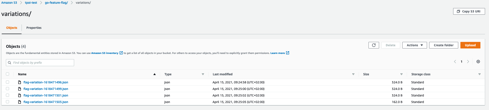

# S3 Exporter

The **S3 exporter** will collect the data and create a new file in a specific folder everytime we send the data.

Everytime the `FlushInterval` or `MaxEventInMemory` is reached a new file will be added to S3.

!!! Info
    If for some reason the S3 upload failed, we will keep the data in memory and retry to add the next time we reach `FlushInterval` or `MaxEventInMemory`.




Check this [complete example](https://github.com/thomaspoignant/go-feature-flag/tree/main/examples/data_export_s3) to see how to export the data in S3.

## Configuration example
```go linenums="1"
ffclient.Config{ 
    // ...
   DataExporter: ffclient.DataExporter{
        // ...
        Exporter: &ffexporter.S3{
            Format: "csv",
            FileName: "flag-variation-{{ .Hostname}}-{{ .Timestamp}}.{{ .Format}}",
            CsvTemplate: "{{ .Kind}};{{ .ContextKind}};{{ .UserKey}};{{ .CreationDate}};{{ .Key}};{{ .Variation}};{{ .Value}};{{ .Default}}\n",
            Bucket:    "my-bucket",
            S3Path:    "/go-feature-flag/variations/",
            Filename:  "flag-variation-{{ .Timestamp}}.{{ .Format}}",
            AwsConfig: &aws.Config{
               Region: aws.String("eu-west-1"),
           },
        },
    },
    // ...
}
```

## Configuration fields
| Field  | Description  |
|---|---|
|`Bucket `   |   Name of your S3 Bucket. |
|`AwsConfig `   |  An instance of `aws.Config` that configure your access to AWS *(see [this documentation for more info](https://docs.aws.amazon.com/sdk-for-go/v1/developer-guide/configuring-sdk.html))*.  |
|`CsvTemplate`   |   *(optional)* CsvTemplate is used if your output format is CSV. This field will be ignored if you are using another format than CSV. You can decide which fields you want in your CSV line with a go-template syntax, please check [internal/exporter/feature_event.go](https://github.com/thomaspoignant/go-feature-flag/blob/main/internal/exporter/feature_event.go) to see what are the fields available.<br>**Default:** `{{ .Kind}};{{ .ContextKind}};{{ .UserKey}};{{ .CreationDate}};{{ .Key}};{{ .Variation}};{{ .Value}};{{ .Default}}\n` |
|`Filename`   | *(optional)* Filename is the name of your output file. You can use a templated config to define the name of your exported files.<br>Available replacement are `{{ .Hostname}}`, `{{ .Timestamp}`} and `{{ .Format}}`<br>Default: `flag-variation-{{ .Hostname}}-{{ .Timestamp}}.{{ .Format}}`|
|`Format`   |   *(optional)* Format is the output format you want in your exported file. Available format are **`JSON`** and **`CSV`**. *(Default: `JSON`)* |
|`S3Path `   |   *(optional)* The location of the directory in S3. |

Check the [godoc for full details](https://pkg.go.dev/github.com/thomaspoignant/go-feature-flag@v0.11.0/ffexporter#S3).
