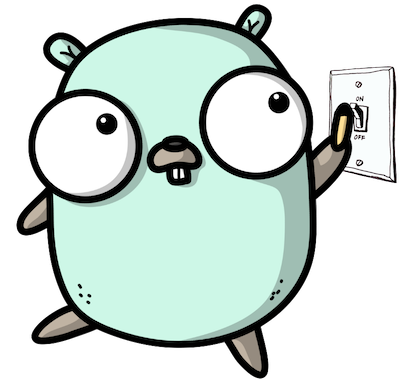

!!! warning
    This is a work in progress documentation.


<p align="center">
  
</p>

<p align="center">
    <a href="https://app.circleci.com/pipelines/github/thomaspoignant/go-feature-flag"></a>
    <a href="https://coveralls.io/github/thomaspoignant/go-feature-flag"></a>
    <a href="https://sonarcloud.io/dashboard?id=thomaspoignant_go-feature-flag"></a>
    <a href="https://github.com/thomaspoignant/go-feature-flag/actions?query=workflow%3ACodeQL"></a>
    <a href="https://app.fossa.com/projects/git%2Bgithub.com%2Fthomaspoignant%2Fgo-feature-flag"></a>
    <br/>
    <a href="https://github.com/thomaspoignant/go-feature-flag/releases"></a>
    <a href="https://pkg.go.dev/github.com/thomaspoignant/go-feature-flag"></a>
    
    <a href="LICENSE"></a>
    <a href="https://replit.com/@thomaspoignant/go-feature-flag-example#main.go"></a>
    <a href="https://github.com/avelino/awesome-go/#server-applications"></a>
</p>

# go-feature-flag

**Feature flags with no complex system to maintain!**

## Installation

```bash
go get github.com/thomaspoignant/go-feature-flag
```

## What is go-feature-flag?

A simple and complete feature flag solution, without any complex backend system to install, you need only a file as your
backend.

No server is needed, just add a file in a central system and all your services will react to the changes of this file.

`go-feature-flags` supports:

- Storing your configuration flags file on various locations ([`HTTP`](#from-an-http-endpoint)
  , [`S3`](#from-a-s3-bucket), [`GitHub`](#from-github), [`file`](#from-a-file)).
- Configuring your flags in various [format](#flags-file-format) (`JSON`, `TOML` and `YAML`).
- Adding complex [rules](#rule-format) to target your users.
- Run A/B test experimentations.
- Getting notified when a flag has changed ([`webhook`](#webhooks) and [`slack`](#slack)).
- Exporting your flags usage data ([`s3`](#s3-exporter), [`log`](#log-exporter) and [`file`](#file-exporter)).

If you are not familiar with feature flags also called feature Toggles you can read
this [article of Martin Fowler](https://www.martinfowler.com/articles/feature-toggles.html)
that explains why this is a great pattern.

I've also wrote an [article](https://medium.com/better-programming/feature-flags-and-how-to-iterate-quickly-7e3371b9986)
that explains why feature flags can help you to iterate quickly.
