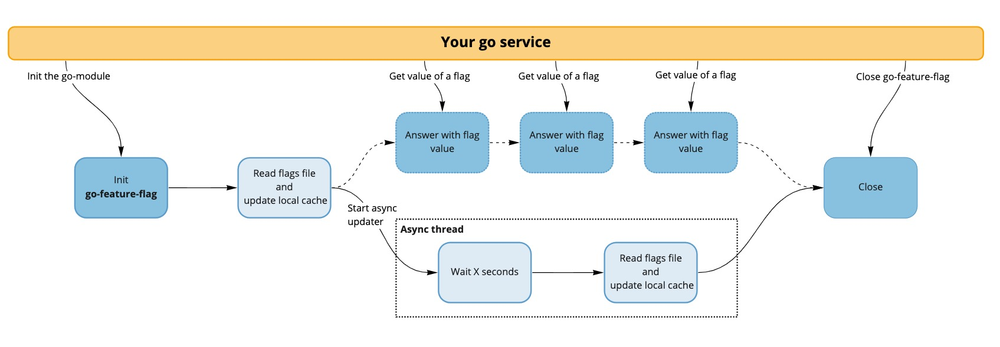
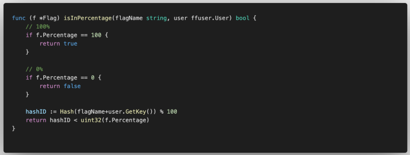

<center>

  
  
</center>

I absolutely don’t think human/manual QA gates should be involved in between the writing of code and its being live. To avoid breaking things every time and to have an early cutoff system, you should use feature flags.

There are a lot of systems available on the market to manage your flags, like [LaunchDarkly](https://launchdarkly.com/) or [UNLEASH](https://unleash.org/), that have Golang support — but this option is expensive, and you have to host a server somewhere to manage your flags.

From this starting point, I came up with the idea to create a simple library with only one file in the back end. This file can be stored in different places (AWS S3, GitHub, an HTTP endpoint somewhere, etc.). This is the only thing you have to host — all the decision logic stands inside the Go module.

<!-- truncate -->

---

## Why a new solution?

There are some solutions available for Go to manage feature flags. I can classify them into two categories:

- You need to run a specific service: [markphelps/flipt](https://github.com/markphelps/flipt), [checkr/flagr](https://github.com/checkr/flagr), [Unleash/unleash](https://github.com/Unleash/unleash), [vsco/dcdr](https://github.com/vsco/dcdr), etc.
- You need to have a database: [xchapter7x/toggle](https://github.com/xchapter7x/toggle), [AntoineAugusti/feature-flags](https://github.com/AntoineAugusti/feature-flags), etc.

All of these solutions are great and have a lot of features, but I was a bit worried about having a full setup with things to install before doing feature flags on a basic service.

I don’t want to host/maintain/monitor a full feature-flag system if my needs are really small.

So I decided to make go-feature-flag, a simple and easy-to-implement feature-flag system, with no back end at all except a shared configuration file you can store anywhere (S3, GitHub, HTTP endpoint, etc.).

The goal is to experience the usage of feature flags without a complex solution, and if you end up liking it and need a more advanced pattern, you can go to any open-source solution or SaaS solution — like LaunchDarkly, for example.

--- 

## How Does It Work?

How this Go module works is easy. It just reads the shared file every x seconds and gives you a way to get the value of your flag in the type you expect.



As you can see, what go-feature-flag is providing is a way for you to keep in sync with the feature-flag config file. It also allows you to evaluate the flag for your users.

A rule system based on [nikunjy/rules](https://github.com/nikunjy/rules) allows you to specify complex rules to apply the flag only for a subset of your users.

The percentage allows you to select which percentage of users will get the true value, but I’m sure you wonder how the repartition is done. It’s really easy — we’re doing a hash of the key of the user with the flag name used as a salt (it guarantees that the repartition isn’t always to the same users).



---

## How to Use It

The main goal of go-feature-flag is to be super simple so you don’t have much to do in order to use it.

- The first thing to do is host your config file somewhere (S3, GitHub, etc.)
- During app initialization, init go-feature-flag with a configuration:

```go
err := ffclient.Init(ffclient.Config{
    PollInterval: 3,
    Retriever: &ffClient.HTTPRetriever{
        URL:    "https://raw.githubusercontent.com/thomaspoignant/go-feature-flag/main/testdata/test.yaml",
    },
})
defer ffclient.Close()
```

- Now that you’ve done an init on go-feature-flag, you can see the value of the flag for your users, with something like this:

```go
user := ffcontext.NewEvaluationContext("user-unique-key")
hasFlag, _ := ffclient.BoolVariation("test-flag", user, false)
if hasFlag {
    // flag "test-flag" is true for the user
} else {
    // flag "test-flag" is false for the user
}
```

**Note**: Your variation will return the default value (the last parameter) if you have an error (flag not present, wrong type, etc.).

- It’s a basic example, but you can put as many properties as you want for your User to make complex queries on your flag

```go
user = ffcontext.NewEvaluationContextBuilder("user-unique-key").
 AddCustom("firstname", "John").
 AddCustom("lastname", "Doe").
 AddCustom("email", "john.doe@example.com").
 Build()
```

This allows you to have a rule like `email eq "john.doe@example.com"` to select a specific user with your flag.

--- 

## What’s Next?
As you can see go-feature-flag is simple, and the goal is to keep it as simple as possible. But this doesn’t mean it’s finished.

For now, I see an evolutionary path for go-feature-flag: First, it should be able to store the flag config file anywhere, so we have to support more retrievers. The second thing is to get more feedback. For now, we’re logging some stuff, but maybe some users would like to have a webhook or Slack notification.

go-feature-flag is also open to contribution, so if you want to contribute any ideas or help, I’d really love to hear from you concerning what you think about this library and what you want in it.

So feel free to write [a discussion](https://github.com/thomaspoignant/go-feature-flag/discussions) on GitHub, open an [issue](https://github.com/thomaspoignant/go-feature-flag/issues), or send me an [email](mailto:contact@gofeatureflag.org).
