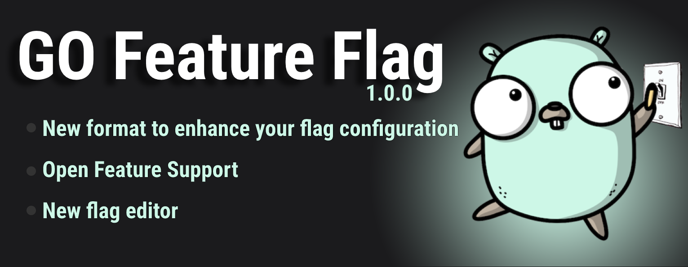

# Announcing GO Feature Flag v1.0.0, get more from your feature flags

We are so happy to finally announce that **GO Feature Flag** v1.0.0 is released. 🎉 🥳 🚀

It was a long journey before this release but we are happy to propose you an even better experience with feature flags always keeping simplicity in mind and building a lightweight solution.

Our goal is still the same, we want you to experience the world of feature flags with a lightweight self hosted solution.

with this new version you will now be able to enhance your usage of feature flagging with opening the creation of more complex and more advance toggles.

# What is changing?

## Flag configuration format

The main change is the format of your flags configuration. 

After using the version `v0.x.x` for quite some time we notice some limitation on the way our flag configuration was designed.
It was hard to return more than 2 different values with the same flag and we wanted to find a better way to represent our flags to be more extensible.

The new representation of the flag is a bit more verbose but allows a lot more possibility in the long term, being able to create more advanced flag.

**Old format:**

In the previous versions the flag representation was looking like this:

```yaml
test-flag:
  rule: key eq "random-key"
  percentage: 40
  true: true
  false: false
  default: false
```

As you can see on this example you can only have a value for the `true` variation and for the `false` variation, the `default`variation was applying if the user was not part of the `rule`.

**New format:**

The same flag in the new format will looks like this:

```yaml
test-flag:
  variations:
    variation_A: true
    variation_B: false
  targeting:
    - query: key eq "random-key"
      percentage:
        variation_B: 60
        variation_A: 40
  defaultRule:
    variation: variation_B
```

With the new format you have an unlimited number of variation possible you can define but also more than one rule for a specific flag.

It allows to target different types of users with different values for the same feature flag.

Let’s take a real life example, we want to get the background color for our website based on this criterias:

- `pro` users should have a red background
- `enterprise` users should have a green background
- **40%** of the `free` users should have a **grey** background and **60%** a **yellow** background
- **other types** of user have a white background

We can come-up with a flag, the configuration will look like this:

```yaml
user-background-color:
  variations:
    pro: #ff1f00
    enterprise: #114f03
    free_grey: #b0b3af
    free_yellow: #ecec0a
    default: #ffffff
  targeting:
    - query: type eq "pro"
      variation: pro
    - query: type eq "enterprise"
      variation: enterprise
    - query: type eq "free"
      percentage:
        free_grey: 40
        free_yellow: 60
  defaultRule:
    variation: default
```

As you can see we can have a way more advanced flag configuration with this new format. This format is solving all the limitation we had with the version `v0.x.x` of **GO Feature Flag**.

### Migrate from v0.x.x to v1.x.x

First of all you should know that all flags from the version `v0.x.x` are still compatible with this new version of **GO Feature Flag**. We made it possible to reduce the disagreement to have to convert all your flag directly.

**BUT** we encourage you to migrate your flag to the new version and for this we have created a tool called `go-feature-flag-migration-cli` to convert flags in `v0.x.x` format to `v1.0.0` format.

The easiest way to use it is probably to use our docker image like this:

```bash
docker run \
  -v $(pwd)/your/configuration_folder:/config \
  thomaspoignant/go-feature-flag-migration-cli:latest \
  --input-format=yaml \
  --input-file=/config/my-go-feature-flag-config-v0.x.x.yaml \
  --output-format=yaml \
  --output-file=/config/my-go-feature-flag-config-v1.x.x.yaml
```

## Documentation

We use the opportunity of the `v1.0.0` to revamp our documentation and to highlight how you can use **GO Feature Flag** in 2 different modes.

- **The GO module**, this is where we started and this is the core of what we propose. In the documentation you will find all the information on how to use the module into your GO project.
- Using **Open-Feature**, the new open-source vendor agnostic standard for feature flags. You can use the `relay-proxy` our server component that allows to use **GO Feature Flag** with multiple languages *(for now we support `javascript`, `typescript`, `java`, `GO` and `.Net`)*. In the documentation you will find how to use the **GO Feature Flag providers** in combination with the **Open Feature SDKs**.

## Flag Editor

Our old flag editor was not compatible anymore with the new `v1.0.0` flag format. 

So we decided to restart our flag editor from scratch and to allow the possibility to create flags configuration from a simple UI. 


For now it is a tiny UI that make your life easier, but the goal is to evolve it more and more to be the place where you want to go to build your new feature flags.

# What has not changed?

Yes a lot of things have changed but our internals are solids and we have ensure to be consistent with the previous versions.

Our main points of attention where the following:

- User segmentation is similar between `v0.x.x` and `v1.0.0` meaning that if a user was affected by a flag (in a percentage for example) he will continue to be in the same cohort.
- All `retrievers` and data `exporters` have not changed and are still working exactly the same way as before.
- You can continue using **GO Feature Flags** with your old flags.
- Moving to the version `v1.0.0` is transparent and you just have to change the version.
- You can still use our advance rollout capabilities such as **experimentation**, **scheduled rollout**, **progressive rollout …**

# Feedback

Feedbacks is our only way to evolve GO Feature Flag, so please contact us to give us any feedback.

- Via [email](mailto:contact@gofeaturegflag.org)
- Via a [GitHub Issue](https://github.com/thomaspoignant/go-feature-flag/issues/new/choose)
