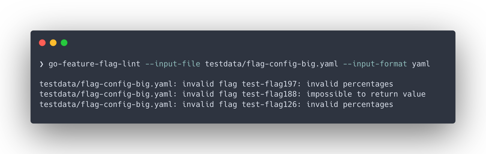

import Tabs from '@theme/Tabs';
import TabItem from '@theme/TabItem';
import styles from './styles.module.css';

# Lint your feature flag config in you CI/CD pipelines ❌✅

As our product **GO Feature Flag** continues to evolve, we're excited to announce a new feature that will make it easier for our users to manage their feature flags.
We are introducing the ability to **lint your feature flag configuration**, which will help ensure that your feature flag configurations are correct and **error-free**.



<!-- truncate -->

## Introducing `go-feature-flag-lint`
Managing feature flags can be challenging, especially when it comes to configuring them correctly.
With our new command line [`go-feature-flag-lint`](/docs/linter), we are providing a tool that helps you avoid making mistakes in your feature flag configuration.

To use the feature flag configuration linting feature, simply run the command line, it will analyze your configuration to ensure that it is free of errors.
If there are any issues, `go-feature-flag-lint` will provide you with a detailed report that identifies the problem to help you to fix it.

To get the maximum benefit from this feature, we recommend integrating it into your **CI/CD pipelines** to catch any issues before they make it to production.

The benefits of using our feature flag configuration linting feature, along with integrating it into your CI/CD pipelines, include:

- Ensuring that your feature flag configuration is correct, which will reduce the risk of issues and errors in your application.
- Saving time and effort by automating the process of checking your feature flag configuration.

## Configure your CI/CD pipelines

Integrating the feature flag configuration linting into your CI/CD pipeline is simple.
First, you will need to install the `go-feature-flag-lint` CLI tool, which can be used to run the linting process.
Next, you can add a new step to your pipeline that runs the `go-feature-flag-lint` CLI tool to lint your feature flag configuration file.

If there are any issues detected, the CLI tool will exit with a non-zero status code, which will cause your pipeline to fail.
By integrating the feature flag configuration linting into your CI/CD pipeline, you can catch any issues with your feature flag configuration before it is deployed to production, reducing the risk of errors and issues.

Here's some examples of how to integrate the feature flag configuration linting into a CI/CD pipeline for popular CI/CD services:

<Tabs groupId="code">
    <TabItem value="githubaction" label="Github Action" attributes={{className: styles.github}}>

```yaml
name: "Build"
on:
  push:
    branches:
      - main
  pull_request:
    types: [ opened, synchronize, reopened ]

jobs:
  Lint:
    runs-on: ubuntu-latest
    steps:
      - name: Checkout repository
        uses: actions/checkout@v3

      - name: Download go-feature-flag-lint
        run: curl -L $(curl -s https://api.github.com/repos/thomaspoignant/go-feature-flag/releases/latest | jq -r '.assets[] | select(.name|match("Linux_x86_64.tar.gz$")) | .browser_download_url' | grep 'go-feature-flag-lint') --output release.tar.gz && tar -zxvf release.tar.gz

      - name: Run go-feature-flag-lint
        run: ./go-feature-flag-lint --input-format=yaml --input-file=flag-config.yaml # please put the right file name
```

  </TabItem>
    <TabItem value="circleci" label="CircleCi" attributes={{className: styles.circleci}}>

```yaml
version: 2.1
jobs:
  build:
    docker:
     - image: cimg/base:2022.05

    steps:
      - checkout
      - run: curl -L $(curl -s https://api.github.com/repos/thomaspoignant/go-feature-flag/releases/latest | jq -r '.assets[] | select(.name|match("Linux_x86_64.tar.gz$")) | .browser_download_url' | grep 'go-feature-flag-lint') --output release.tar.gz && tar -zxvf release.tar.gz
      - run: ./go-feature-flag-lint --input-format=yaml --input-file=flag-config.yaml # please put the right file name
```

  </TabItem>
    <TabItem value="gitlab" label="Gitlab" attributes={{className: styles.gitlab}}>

```yaml
image: ubuntu
lint-job:
  stage: build

  before_script:
    - apt-get -qq update
    - apt-get install -y jq curl

  script:
    - curl -L $(curl -s https://api.github.com/repos/thomaspoignant/go-feature-flag/releases/latest | jq -r '.assets[] | select(.name|match("Linux_x86_64.tar.gz$")) | .browser_download_url' | grep 'go-feature-flag-lint') --output release.tar.gz && tar -zxvf release.tar.gz
    - ./go-feature-flag-lint --input-format=yaml --input-file=flag-config.yaml # please put the right file name
```

  </TabItem>

</Tabs>


## Conclusion

We are thrilled to be introducing this new feature, which we believe will make a significant difference in how our users manage their feature flags. With the introduction of feature flag configuration linting, we are providing a tool that will make it easier for you to manage your feature flags and get the most out of our product.

If you have any questions about this feature or would like more information, please don't hesitate to get in touch with our support team. We're always here to help!