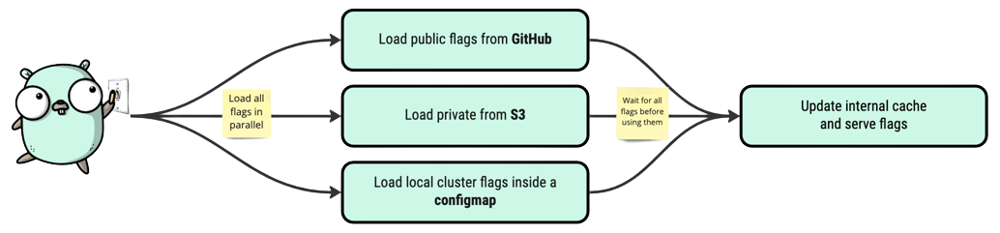

import Tabs from '@theme/Tabs';
import TabItem from '@theme/TabItem';

# Support Of Multiple Configuration Flags 🗄️

__Are you tired of managing your feature flags with a single configuration flag?__

We've got good news for you **GO feature flag** now supports multiple configuration flags! Plus, we've added a new 
feature that allows all files to be loaded in parallel, making it faster and more efficient.



Managing feature flags can be a challenging task, especially as your application grows and becomes more complex.
With multiple configuration flags, you can easily manage different feature flag configurations for different apps, user groups, or any other criteria that you need.
You can also use the same flags for multiple features, making it easier to maintain and update your code.

In addition to multiple configuration flags, we've also ensured that all files are downloaded in parallel.
This means that your feature flag configurations will be downloaded faster and more efficiently, improving the performance of your application.

<!-- truncate -->

## How to configure multiple flag configuration files
To configure GO Feature Flag using multiple configuration flags files, simply create multiple files and store them in your favorite place.

Then, use the field `retrievers` in your configuration to configure all the access to your configuration flags.

<Tabs groupId="code">
    <TabItem value="relayproxy" label="Relay Proxy Configuration">

```yaml
# ...
retrievers:
  - kind: http
    url: https://raw.githubusercontent.com/thomaspoignant/go-feature-flag/main/examples/retriever_file/flags.yaml
  - kind: file
    path: /local/flag-file.yaml   # Example of local path
  - kind: http   # you can have multiple time the same type of retriever
    url: https://raw.githubusercontent.com/thomaspoignant/go-feature-flag/main/testdata/flag-config.yaml

# Before we were using the field retriever that allows only one retriever at the time
# 
# retriever:
#   kind: http
#   url: https://raw.githubusercontent.com/thomaspoignant/go-feature-flag/main/examples/retriever_file/flags.yaml

```

  </TabItem>
    <TabItem value="gomodule" label="GO Module Configuration">

```go
err := ffclient.Init(ffclient.Config{
  // ...
  Retrievers: []retriever.Retriever{
    &fileretriever.Retriever{
      Path: "examples/retriever_multiple_config_files/flags.yaml",
    },
    &fileretriever.Retriever{
      Path: "examples/retriever_multiple_config_files/flags2.yaml",
    },
  },
  //...

  // Before we were using the field retriever that allows only one retriever at the time
  //
  // Retriever: &fileretriever.Retriever{
  //     Path: "examples/retriever_multiple_config_files/flags.yaml",
  // },
})
```

  </TabItem>
</Tabs>


## What happen if 2 files have the same flag?
We are taking all the configuration files in the order of the `retrievers`. It means than the latest version of your flag will be the one from the latest file.

:::tip example
We have 3 files that contains the flag `my-flag` and there are in this order in the retriever list :
1. `flag-s3.yaml`
2. `flag-configmap.yaml`
3. `flag-github.yaml`

The flag configuration we will use to evaluate your flag will be the one that is in the file `flag-github.yaml`
:::


## Conclusion
We believe that multiple configuration flags and parallel downloads will make it easier for you to manage your feature flags and provide more flexibility to your development process.
We hope you find these features useful, and we look forward to hearing your feedback!

If you have any questions or comments, please don't hesitate to reach out to us. We're always happy to help!

