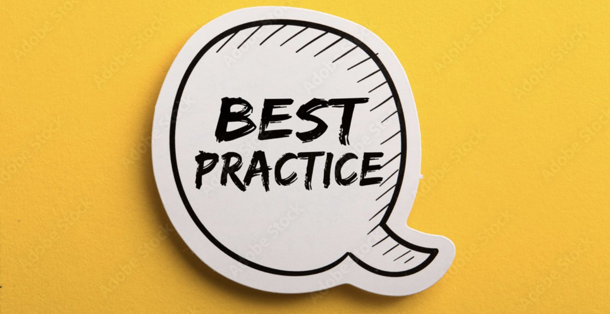

import Link from '@docusaurus/Link';

Feature flags are a powerful tool for software development, allowing for more flexible and adaptable development processes.

However, to get the most out of feature flags, it's important to follow some best practices to ensure they are used effectively and efficiently.

<!-- truncate -->

---

## 🤷 Keep flags simple and scoped
One of the most important best practices for feature flags is to keep them **simple** and **scoped**.

This means avoiding overly complex flags that do too much, and instead using small, targeted flags that can be easily managed and maintained.
Keeping flags simple and scoped helps to avoid confusion and reduces the risk of bugs or other issues.

## ⏰ Avoid using flags as a long-term solution
Another important best practice is to avoid using feature flags as a long-term solution.

Feature flags should be used as a temporary measure to test new features or functionality, and then removed once the feature is fully tested and released.

Leaving flags in place for too long can lead to code bloat and confusion, making it harder to maintain and update your codebase.

## 🧪 Test and monitor flags
Testing and monitoring flags is essential to ensuring they are working as intended.

This means setting up a testing environment where you can test flags in a controlled environment, as well as monitoring
the usage of flags in production to ensure they are not causing any issues.

By testing and monitoring flags, you can catch any issues early and avoid potential problems down the line.

## 🎯 Centralize your feature flags in a single location

Centralize your feature flags in a single location, such as a feature flag management system _(GO Feature Flag is here to help you)_, to make it easier to
manage and track them across different applications and environments.

This can help avoid conflicts and inconsistencies, improve collaboration among teams, and reduce the risk of introducing bugs or unintended consequences.

It also helps to use the same flag for multiple applications and to be able to act on a distributed systems.

## 📝 Document flags and their purpose
Documenting flags and their purpose is another best practice that can help to avoid confusion and ensure that everyone on the team is on the same page.

This means providing clear documentation for each flag, including its purpose, when it should be used, and any relevant notes or instructions.
This can help to prevent misunderstandings and ensure that flags are used correctly.

## 🔨Use feature flags in combination with other tools
Finally, it's important to remember that feature flags are just one tool in your development toolbox.

To get the most out of feature flags, it's important to use them in combination with other tools, such as testing
frameworks, monitoring tools, CI/CD, and version control systems.

By using feature flags in combination with other tools, you can create a more comprehensive and effective development process.

---

# Conclusion
Following these best practices can help to ensure that your feature flags are used effectively and efficiently, allowing you to take full advantage of the benefits they offer.

By keeping flags simple and scoped, avoiding long-term use, testing and monitoring flags, documenting flags and their purpose, and using feature flags in combination with other tools, you can create a more flexible and adaptable development process that can help you to stay ahead of the competition.

  <Link to={'/docs'} >
    <button className="pushy__btn pushy__btn--md pushy__btn--black">
      Getting started with GO Feature Flag
    </button>
  </Link>

