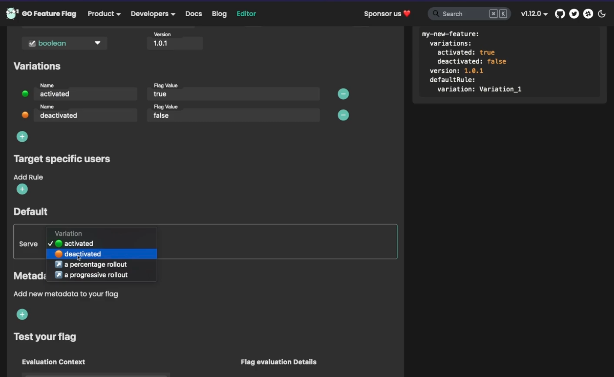
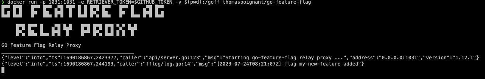

<iframe width="100%" height="444" src="https://www.youtube.com/embed/ascFFZqjQAI" title="YouTube video player" frameborder="0" allow="accelerometer; autoplay; clipboard-write; encrypted-media; gyroscope; picture-in-picture; web-share" allowfullscreen></iframe>

Welcome to this tutorial on using feature flags in Node js with GO Feature Flag and Open Feature SDKs.

In this video, we'll walk you through the process of implementing feature flags in your Node js applications, allowing you to roll out new features gradually and control their visibility in real-time.

<!-- truncate -->

## Setup GO Feature Flag
Before we proceed with the implementation, it's essential to set up GO Feature Flag to efficiently evaluate our flags.
To achieve this, we will create a new file called `goff-proxy.yaml` that will contain the configuration on how to retrieve our feature flags' configuration file.

In this file, we will first configure where to retrieve the flags and also a polling interval _(here 5000 milliseconds)_.  
It means that GO Feature Flag will read the file every 5 seconds to check if your configuration has changed.

```yaml
retriever:
  kind: github  # type of retriever we are using
  repositorySlug: thomaspoignant/demo-goff  # repository we are retrieving
  path: flags.yaml  # location of the file in the repository
pollingInterval: 5000  # Time in milliseconds we wait before trying to check for changes
```

## Create our first flag
To create our flag we start by using the [GO Feature Flag editor](https://editor.gofeatureflag.org), for our test we will create a flag
named `my-new-feature` and it will use a type `boolean`.



When it is ready you can  copy/paste the flag definition and commit it in GitHub.

## Start GO Feature Flag
We will now start GO Feature Flag, for this we gonna use the docker image.

```shell
docker run -p 1031:1031 -e RETRIEVER_TOKEN=$GITHUB_TOKEN -v $(pwd):/goff thomaspoignant/go-feature-flag
```

With this command we launch GO Feature Flag on the port 1031 and with the configuration file we just created, you can also see that we provide a GitHub Token, this is to avoid being rate limited by the Github API.



GO Feature Flag is now started, and we can see that our flag is loaded.

## Create Node.JS application using OpenFeature
Now let's start to create our Node JS application.

```typescript
import { GoFeatureFlagProvider } from "@openfeature/go-feature-flag-provider"
import { EvaluationContext, OpenFeature } from "@openfeature/js-sdk"

async function main(){
  // We start by creating an instance of the Go Feature Flag Provider
  // We are just setting the endpoint to connect to our instance of GO Feature Flag
  const provider = new GoFeatureFlagProvider({
     endpoint: 'http://localhost:1031'
  })

  // We associate the provider to the SDK
  // It means that now when we call OpenFeature it will rely on GO Feature Flag as a backend.
  OpenFeature.setProvider(provider)
  
  // We need to ask for a client to evaluate the flags.
  const client = OpenFeature.getClient()

  // We create a context for our evaluation.
  const ctx: EvaluationContext = {
     targetingKey: 'aae1cb41-c3cb-4753-a117-031ddc958f82'
  }

  // We evaluate the flag.
  const myNewFeature = await client.getBooleanValue("my-new-feature", false, ctx)

  if (myNewFeature) {
    // the new feature is available
  } else {
    // apply the old feature
  }
}

main()
```

You are now ready to use GO Feature Flag in your application.

## Conclusion

In this tutorial we've seen how simple it is to use GO Feature Flag in your Node.JS application using the OpenFeature SDK.

I encourage you to read our documentation to see all the amazing possibility that you will have.

And please provide us [feedbacks](mailto:contact@gofeatureflag.org) on how we can make your experience even better.
