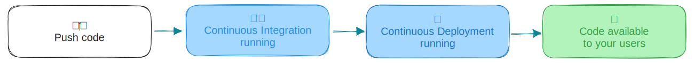
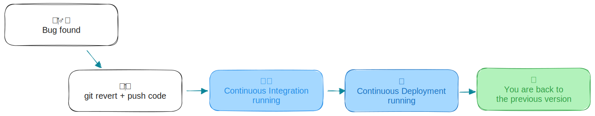
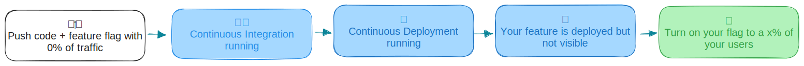
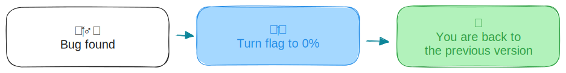

As software engineers, the process of releasing new features and updates can be both exhilarating and nerve-wracking.  
You've put in countless hours of hard work, and the moment has arrived to introduce your latest creation to the world. 

**But what happens when things don't go as planned? What if a new feature causes unforeseen issues or negatively impacts your users?**

This is where feature flags come to the rescue, offering a safety net that allows you to roll back features immediately without waiting for a deployment. In this blog post, we'll explore why feature flags are an essential tool for securing your software releases.

## The old way of doing rollbacks

If you are not using feature flags, your release process probably look like this:


1. You code your new feature.
2. Your CI/CD is in charge to put your code in production.
3. Your new feature is available to all your users.

**BUT what happen if your releases needs to be rollback?**



You will most likely use the same process and go with something like
1. Revert your code and push the code.
2. Your CI/CD is in charge to put your code in production.
3. Your rollback is effective.

Don't get me wrong this works, and you are probably doing it for years, but here are some problems your may occur while doing it:
- You have to identify what was changed and rollback the code to rollback the code associated to your feature.
- If you are unlucky, your main branch has changed since your last deployment, so coming back to the previous state may require to rollback more than your feature, and it can impact other teams.
- Depending on your deployment pipeline it can take minutes to hours to push your rollback in production.

## Secure your release using feature flags
### How feature flags can help here?
The main things we try to achieve here is to unlink deploy and release.
Changing your release process with feature flags is important if you want to secure your way to release new feature in your application.

To achieve this we will follow these steps:

1. Create a dedicated feature flag for this feature. This flag should be independent of other flags and only control the state of this new feature.
2. In your application's codebase, implement checks that will monitor the state of the flag. This can usually be done with the usage of a `boolean` flag. If the flag is set to "**`false`**" the code should disable the feature's functionality.
3. When deploying the feature to production, ensure that the flag is initially set to `false` position for 100% of your users.
4. When you are ready to release the new feature, set the feature to `true` position for a part of your users.
5. Monitor the feature's performance closely during its initial release.


### BUT what happen if your releases needs to be rollback?

Now that we have a flag for our new feature it makes our life way easier to rollback this new feature, because as you guess we only have to put back the flag to 0% of our users and the feature will not be available anymore. 



### How to do this with GO Feature Flag?

1. Create a new flag
  ```yaml
  my-new-feature:
    variations:
      enabled: true
      disabled: false
    defaultRule:
      percentage:
        enabled: 0
        disabled: 100
  ```
  _As you can see the flag `my-new-feature` will be off for all your users._

2. Wrap your new feature with the check of the flag
  ```go
      evalCtx := of.NewEvaluationContext("d45e303a-38c2-11ed-a261-0242ac120002")
      if client.BooleanValue(ctx, "my-new-feature", false, evalCtx){
        // code of my new feature ...
      }
  ```
  _This example use the OpenFeature GO SDK syntax, but you can do it in any language._ 
  
3. Deploy your code in production.
4. When you are ready to release, edit your flag configuration file to add traffic.
  ```yaml
  my-new-feature:
    variations:
      enabled: true
      disabled: false
    defaultRule:
      percentage:
        enabled: 100
        disabled: 0
  ```
5. 🚨 If you find a bug and you want to rollback, just edit the flag configuration file again and your feature will be rollback.
  ```yaml
  my-new-feature:
    variations:
      enabled: true
      disabled: false
    defaultRule:
      percentage:
        enabled: 0
        disabled: 100
  ```
6. Your feature will be rollback immediately and the good part is that you don't even have deployed anything.

## Conclusion

In the dynamic world of software engineering, ensuring the security of your releases is paramount.  
Feature flags offer a powerful mechanism for immediate rollbacks, reducing the risk associated with introducing new features. 

By embracing feature flags, you can respond swiftly to issues, minimize downtime, and make informed decisions based on real-time data.  
The result is a more robust and user-friendly software release process that enhances both the development team's confidence and the end-users' experience. 

So, don't wait—start incorporating feature flags into your development workflow today and unlock the potential for secure and successful releases.