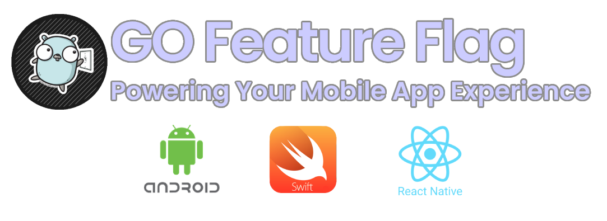

# GO Feature Flag: Now Powering Your Mobile App Experience
We're thrilled to announce a major milestone for GO Feature Flag: **full compatibility with mobile applications**.
That's right, you can now leverage the power of feature flags to optimize your iOS, Android, and React Native apps with unparalleled ease and flexibility.

<!--truncate-->

## Why Mobile Feature Flags Matter?

Mobile app development is a fast-paced world where agility is key. Traditional release cycles can be lengthy and risky. Feature flags provide a dynamic solution by allowing you to control feature visibility without redeploying your app.

**This translates to:**
- Faster time-to-market: Experiment with new features and iterate quickly based on user feedback.
- Reduced risk: Gradually roll out features to minimize potential issues and impact.
- Enhanced control: Turn features on or off in real-time based on user segments or other criteria.

## How GO Feature Flag Delivers for Mobile

To bring feature flags to mobile, we've fully embraced the OpenFeature standard.

**This means:**
- Native support for **iOS** and **Android**: A provider for each platform ensures seamless integration with the OpenFeature SDKs in your mobile app's core.
- **React Native** compatibility: With the usage of GO Feature Flag web provider and the OpenFeature React SDK you can now manage feature flags within your React Native app using familiar JavaScript syntax.

## Diving Deeper into the Tech

When it comes to client side, on the 3 platforms we are using the OpenFeature static paradigm *(client side SDK)*. What does it means?
The key distinction between the client- and server-side feature flagging is the difference in how often evaluation context changes.

When on your mobile device, your evaluation context is changing very rarely since the device is linked to a user. Also, in the client, you expect a very low latency to get the value of your flag.
Based on this idea, the GO Feature Flag providers will retrieve your set of flags and cache them on the device, so you can evaluate them without any network call.

If you want to read more about the OpenFeature static paradigm, you can read this [article from Pete Hodgson](https://openfeature.dev/blog/catering-to-the-client-side) in the OpenFeature blog.

For those interested in the technical details, let's explore how this integration works in this sequence diagram:

[](https://mermaid.live/edit#pako:eNrFVdtO20AQ_ZXV9oEgGUV9aokqpBIuQhUKahBClV829thZsd5x1-tAivj3zl4cJyEE-tQ8Zcdnzpy57T7zDHPgI97A7xZ0BmdSlEZUqWb0q4WxMpO10JaJumaiYdc4kwrcSclMWIn6NRQLh5zUoAsQtjXApmc_vs3M8GQgNVtia5jCTCjHcvja3ce5nLCL6HyhRMluDC5kDubjNCUWxS6mn6DE0vE9LQOZgQotEEPg0HRguADjeBNPM2JXWloplGx8yi5Dl95Fnx57lHb-purATHxHJydIdA3Y7tPgchJdnEdnTWAhVOuDjVFbeLIxQyyIoh4xGQX9gcFbUBcsqP9-c8VuJtNbNsTCQD1cfB5GJxgWFLXZzrxOesexUIpZZCXQELi_c2DeiXUcua-jKIXUjfXfe0ksC5pCBMd6FBJYi1sHy1hk5LoeYo2n6dqjEGtGwOwhQLK50CVEpt1ZjD1aFo6XOiMbJpysQpatiSI9CYUDE4binlpEkJygOmcGqGzN3OuSlI7RNHWZk9uHdUmwfyr3VkGCEXTeFSXOyqrvLgCNkLPsmVQ_d-erum1PHnXxFFGB0HcEgUHKq-WRE5XyhBVCNbAaNBZ0UeaoFhC9eubBQfQ8ONxS7CDQs5DVy47mPdrHoQ203buHKOxrgYbBk6hqdw8V1lHQVJTk1V0L_YWwsXJxPQYaHs_fWa-VfQp78f9xx0jVm3v2wY3aOWdsc9Biw3jCKzCVkDk9Fs_OlHIirSDlhOMz0dC_ZM1-J4wUM0WbSYDnbuJTXhtZCbMco0ITfD9lUHyBr9E9oFyZTh_Kd1CR65byXkceHx9vwJTUsO87jRDdpZuaPCZAXlL9QumL1uJ0qTM-sqaFhLd1Tn2J7-Wm8TyXFg0f-X1KOPjjdXhow8VDfPRI_UKsViiDbTmPp5e_6kKEdw)

As you can see, the provider is keeping all the flags in memory to serve them as fast as possible without any network call.

## How to integrate GO Feature Flag into your mobile app?

Ready to supercharge your mobile app development with GO Feature Flag? Here's how to get started:
- [Integrate the OpenFeature SDK into your iOS project](https://gofeatureflag.org/docs/openfeature_sdk/client_providers/openfeature_swift)
- [Integrate the OpenFeature SDK into your Android project](https://gofeatureflag.org/docs/openfeature_sdk/client_providers/openfeature_android)
- [Integrate the OpenFeature SDK into your React Native project](https://gofeatureflag.org/docs/openfeature_sdk/client_providers/openfeature_react)

Our comprehensive documentation provides detailed instructions and examples to guide you through the process.

## The Future of Feature Flags

We're excited about the potential of feature flags to transform mobile app development. With GO Feature Flag's expanded support, we're empowering developers to build better, faster, and more reliable apps.

Stay tuned for future updates as we continue to enhance our platform and explore new possibilities.

Do you have already integrate GO Feature Flag in your mobile app? Let us know your experience in our [Slack channel](http://gofeatureflag.org/slack) or on [X](https://x.com/gofeatureflag).
