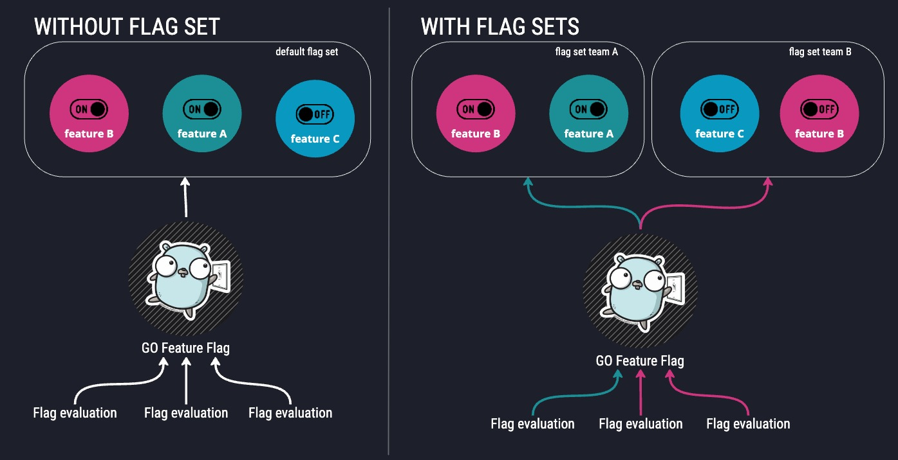

# 🏗️ Introducing Flag Sets: Organize Your Feature Flags Like Never Before

We're excited to announce that we have released one of the most requested feature for GO Feature Flag.  
It will revolutionize how you organize and manage your feature flags: **Flag Sets**! 🎉

As your applications grow and teams expand, managing feature flags can become increasingly complex. Different teams need their own flags, environments require separate configurations, and multi-tenant applications demand isolated flag management. That's exactly what Flag Sets are designed to solve.

<!--truncate-->

## 🤔 What Are Flag Sets?

---

Flag Sets are a powerful organizational feature in GO Feature Flag that allows you to group related feature flags into separate, isolated collections. Each flag set operates independently with its own:

- **Configuration**: Retrievers, exporters, and notifiers
- **API Keys**: Secure access control with dedicated authentication
- **Flag Management**: Complete isolation from other flag sets
- **Data Tracking**: Separate evaluation data and analytics

Think of flag sets as **"virtual feature flag environments"** within your single GO Feature Flag relay proxy instance.  
They provide the organizational benefits of multiple instances while maintaining the simplicity of a single deployment.

## ✨ What are the benefits of flag sets?

---

### 🏢 **Team Isolation**

In modern software development, different teams often need to manage their own feature flags independently. With flag sets, you can:

- **Team A**: Manage application A feature flags: `new-navigation`, `dark-mode`, `responsive-design`.
- **Team B**: Manage application A feature flags: `new-payment-api`, `caching-strategy`, `rate-limiting`, `dark-mode`.
- ...

Each team gets their own isolated environment without interfering with others.

- You can have the same feature flag name with a different configuration.
- Team A cannot access to Team B feature flags.
- Each flag set can have a dedicated exporter.
- Each flag set can notify flag changes in a different place.

### 🏘️ **Multi-Tenant Applications**

For applications serving multiple customers or organizations, flag sets provide perfect isolation:

- Each customer gets their own flag set.
- No risk of flag name collisions between customers.
- Isolated configurations and data tracking.
- Secure access control per customer.
- Routing to the flag set is based on API Keys.

## ⚙️ How Flag Sets Work

---

### Configuration Structure

Flag sets are configured in your relay proxy configuration file, instead of defining your configuration on top level of the file we have introduce a new field called flagset.

In each flag set you can configure his behavior like in this example:

```yaml
server:
  mode: http
  port: 1031
flagsets:
  - name: team-a
    apiKeys:
      - 'team-a-api-key-1'
      - 'team-a-api-key-2'
    retrievers:
      - kind: file
        path: /flags/team-a-flags.yaml
    exporters:
      - kind: s3
        bucket: team-a-evaluations
    notifiers:
      - kind: slack
        webhookUrl: 'https://hooks.slack.com/services/team-a-webhook'

  - name: team-b
    apiKeys:
      - 'team-b-api-key'
    retrievers:
      - kind: github
        repository: my-org/team-b-flags
        path: flags.yaml
    exporters:
      - kind: kafka
        topic: team-b-evaluations
    notifiers:
      - kind: discord
        webhookUrl: 'https://discord.com/api/webhooks/team-b-webhook'

  - name: team-c
    apiKeys:
      - 'team-c-api-key'
    retrievers:
      - kind: s3
        bucket: team-b-feature-flags
        item: flags.yaml
    exporters:
      - kind: file
        outputDir: /logs/team-c-evaluations
    pollingInterval: 1000
```

As you can see, you are able to configure every flag sets differently.

### API Key-Based Routing

The magic of flag sets lies in their API key-based routing system:

1. **Extract API Key**: The relay proxy extracts the API key from the `Authorization` header.
1. **Find Flag Set**: It looks up which flag set is associated with that API key.
1. **Route Request**: The evaluation request is routed to that specific flag set.
1. **Return Result**: The evaluation result comes from that flag set's flags.

This means you can have identical flag names across different flag sets without any conflicts ✨.

### OpenFeature Provider Integration

Using flag sets in your applications is straightforward. You simply initialize your providers with the correct API key.  
All the providers have a way to pass the API Key to use, based on this one the relay proxy will route the request to the correct flag set.

## Key Benefits of using flag sets

---

### 🔒 **Complete Isolation**

- No inheritance between flag sets
- Identical flag names can exist across different sets
- Independent configurations and data tracking

### 🔑 **Secure Access Control**

- API key-based authentication for each flag set
- Multiple API keys per flag set for flexibility
- No cross-contamination between teams or customers

### 🎯 **Flexible Configuration**

- Each flag set can have its own retrievers, exporters, and notifiers
- Independent polling intervals and file formats
- Custom notification channels per team

### 📊 **Separate Analytics**

- Evaluation data is tracked separately per flag set
- Independent export configurations
- Team-specific monitoring and alerting

## Migration Guide

---

If you're currently using a single GO Feature Flag configuration, migrating to flag sets is straightforward:

### Option 1: Gradual Migration

1. Ensure that all your providers are using API Keys to connect to GO Feature Flag.
2. Create a flag set and move your actual configuration inside it.
3. Associate your API Keys to the flag set.
4. Create extra flag sets and move flags over them.
5. Change the API Key used in your provider to point to the right flag set.

### Option 2: Full Migration

1. Create flag sets for each team or purpose.
2. Move all flags to appropriate flag sets.
3. Update all applications with new API keys.
4. Remove the old single configuration.

## Get Started Today

Flag Sets are available now in GO Feature Flag! Whether you're managing multiple teams, serving multiple customers, or just want better organization, flag sets provide the flexibility and isolation you need.

### Resources

- 📚 [Flag Sets Documentation](https://docs.gofeatureflag.org/concepts/flagset)
- 🔧 [Configuration Guide](https://docs.gofeatureflag.org/relay-proxy/configure-relay-proxy#use-multiple-flag-sets)
- 💬 [Community Discussions](https://gofeatureflag.org/slack)
- 🐛 [Report Issues](https://github.com/thomaspoignant/go-feature-flag/issues)

We can't wait to see how you use Flag Sets to organize and scale your feature flag management! And please share your feedbacks ! 🚀
