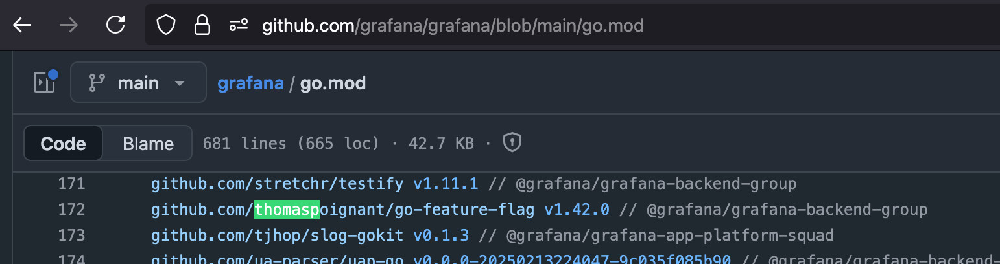

We’re proud to announce that [**Grafana**](https://github.com/grafana/grafana), one of the world’s most popular observability platforms, is now using **[GO Feature Flag](https://gofeatureflag.org)** as a dependency in their project! 🚀

_(Screenshot from Grafana’s `go.mod` file showing GO Feature Flag)_

This is a huge milestone for us. Grafana is one of the most widely used observability platforms in the world, relied upon by countless developers and organizations to monitor and visualize their systems. Seeing such a respected open-source project adopt **GO Feature Flag** is a strong validation of the reliability, performance, and simplicity of our solution.

A big thank you to our community and contributors for making this possible — and to the Grafana team for trusting our solution. ❤️

Here’s to safer rollouts, faster innovation, and more great open-source collaborations ahead! 🚀

We’re incredibly proud of this milestone, but it’s only the beginning. GO Feature Flag continues to evolve, and we’re committed to making it even easier for teams of all sizes to roll out new features with confidence.

If you’re curious about how GO Feature Flag can fit into your projects, check out our [ documentation](https://gofeatureflag.org/docs/) or join our [community](https://gofeatureflag.org/slack/). We’d love to hear from you!

<!-- truncate -->
