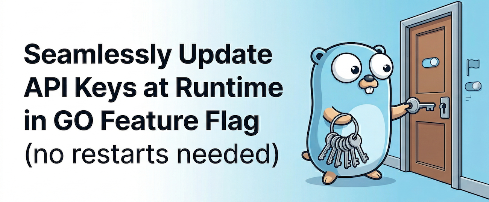

# 🔄 Seamlessly Update API Keys at Runtime in GO Feature Flag (No Restarts Needed)



We're excited to announce a new feature in GO Feature Flag that makes API key management easier and more secure: **Runtime API Key Updates**! 🎉

We've heard from the community that having to restart the relay proxy for every API key update or rotation was a real pain point. Managing API keys is crucial for security, but needing a restart for each change led to unnecessary downtime and interruptions.  
With this new feature, you can now update, rotate, and manage API keys on the fly—your relay proxy keeps running, and requests are served continuously, with no need for restarts.

<!--truncate-->

## 🤔 The Challenge: API Key Management

API keys are essential for securing access to your GO Feature Flag relay proxy. However, managing them has always been challenging:

- **Key rotation** required service restarts, causing downtime
- **Adding new keys** meant taking the service offline
- **Removing compromised keys** couldn't be done immediately
- **No flexibility** to respond quickly to security incidents

These limitations made it difficult to follow security best practices like regular key rotation and immediate response to security threats.

## ✨ Introducing Runtime API Key Updates

GO Feature Flag starting `v1.50.0` supports **updating API keys at runtime** without requiring a restart of the relay proxy.  
This feature works in both **default mode** and **flagset mode**, giving you the flexibility to manage keys dynamically.

:::info
This feature is available starting from GO Feature Flag `v1.50.0` and above.
:::

### Key Benefits

- ✅ **Zero Downtime**: Update keys without interrupting service
- ✅ **Immediate Response**: Remove compromised keys instantly
- ✅ **Easy Rotation**: Rotate keys as soon as you change your configuration file
- ✅ **Flexible Management**: Add, remove, or update keys as needed
- ✅ **Automatic Detection**: Changes are detected and applied automatically

## 🚀 How It Works

The relay proxy continuously monitors your configuration file for changes. When it detects updates to API keys, it:

1. **Validates** the new configuration _(if invalid your new configuration will be ignored)_
2. **Updates** the internal API key mappings
3. **Applies** changes immediately
4. **Continues** serving requests without interruption

All of this happens automatically in the background, with no manual intervention required.

## ⚙️ Configuration Requirements

### Default Mode

In default mode, **only API keys can be updated at runtime**:
- ✅ `authorizedKeys.evaluation`
- ✅ `authorizedKeys.admin`
- ❌ All other configuration changes are ignored

#### 📝 Usage Example

```yaml title="goff-proxy.yaml"
# Initial configuration
authorizedKeys:
  evaluation:
    - "key-1"
    - "key-2"
  admin:
    - "admin-key-1"

# Updated configuration (runtime update - no restart needed!)
authorizedKeys:
  evaluation:
    - "key-1"
    - "key-2"
    - "key-3"  # ✅ New key added
    - "key-4"  # ✅ Another new key
  admin:
    - "admin-key-1"
    - "admin-key-2"  # ✅ New admin key added
```


### Flagset Mode

In flagset mode:
- ✅ API keys for each flag set can be updated
- ✅ Flag sets must have a `name` configured
- ❌ Other flagset configuration changes are not supported

#### 📝 Usage Example

```yaml title="goff-proxy.yaml"
flagSets:
  - name: team-a  # ✅ Name is required for runtime updates
    apiKeys:
      - "team-a-key-1"
      - "team-a-key-2"  # ✅ Can add new keys at runtime
    retrievers:
      - kind: file
        path: /flags/team-a-flags.yaml

  - name: team-b
    apiKeys:
      - "team-b-key-1"
      # ✅ Can remove keys at runtime by removing them from the config
    retrievers:
      - kind: s3
        bucket: team-b-flags
```

:::warning
**Important**: For flagset mode, your flag sets **must have a `name` configured** for runtime updates to work.  
Without a name (or if you use `default` as the name), runtime updates won't be possible since we are not able to target which flagset has changed.
:::

## 🎯 Real-World Use Cases

### Use Case 1: Multi-Tenant Key Management

**Scenario**: Managing API keys for multiple customers in flagset mode.

**Solution**: Update keys for individual flag sets independently. Each customer's keys can be managed separately without affecting others.

### Use Case 2: Scheduled Key Rotation

**Scenario**: Your security policy requires rotating API keys every 90 days.

**Solution**: Update the configuration file with new keys, keep old keys temporarily, migrate clients, then remove old keys—all without downtime.

### Use Case 3: Team Onboarding

**Scenario**: A new team needs access to a flag set.

**Solution**: Simply add their API key to the flag set configuration. No restart needed, and they can start using the service immediately.

## 📚 Learn More

- 📖 [Runtime Configuration Updates Documentation](https://docs.gofeatureflag.org/relay-proxy/configure-relay-proxy#runtime-configuration-updates)
- 📖 [Flag Set Concepts](https://docs.gofeatureflag.org/concepts/flagset)
- 📖 [Configuration Guide](https://docs.gofeatureflag.org/relay-proxy/configure-relay-proxy)

## 🎉 Get Started Today

Runtime API key updates are available in GO Feature Flag starting version `v1.50.0`! This feature makes API key management more secure, flexible, and convenient.

Whether you're rotating keys, responding to security incidents, or managing access for multiple teams, runtime updates ensure your feature flag service remains available and secure.

### Resources

- 💬 [Community Discussions](https://gofeatureflag.org/slack)
- 🐛 [Report Issues](https://github.com/thomaspoignant/go-feature-flag/issues)
- 📚 [Full Documentation](https://docs.gofeatureflag.org)

We can't wait to see how this feature improves your API key management workflow! 🚀
