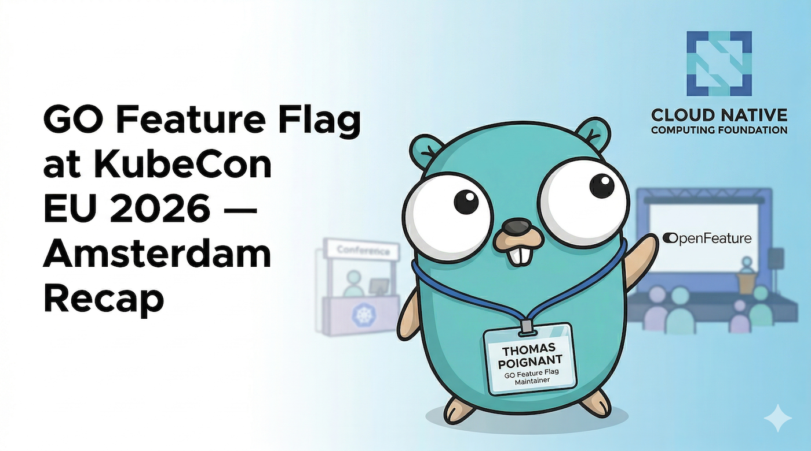

KubeCon + CloudNativeCon Europe 2026 in Amsterdam is behind us, and what a week it was.
For GO Feature Flag, it was both an opportunity to represent the project on a big stage and
to connect directly with the community in person.

<!-- truncate -->

## Speaking at the Maintainer Track

I had the privilege of presenting during the **"OpenFeature Update From the Maintainers"**
session as part of the Maintainer Track on Wednesday. Alongside Lukas Reining, André Silva,
and Alexandra Oberaigner, we shared the latest news from the OpenFeature ecosystem —
including the OpenFeature MCP server, the new GitHub Action for flag cleanup, and the stable
release of OFREP.

The [slides from the session](https://docs.google.com/presentation/d/1I6ulZnEbR1NleY58Q2ppKGIjum8AksOJDwavqb7mp1w/edit#slide=id.p) are available.

## Governance Committee: Shaping the Future of OpenFeature

As a member of the OpenFeature Governance Committee, a big part of the week was
participating in focused in-person discussions with other maintainers and contributors.
These conversations covered some of the most important topics on the project's roadmap.

**Experimentation** was a major theme. The group explored how OpenFeature can better support
experimentation use cases — from standardized context fields and evaluation metrics in the SDK,
to defining how grouped experiments map to flags. There's real momentum here and we should
expect progress on this front through the rest of the year.

**OFREP** (the OpenFeature Remote Evaluation Protocol) is approaching its 1.0 milestone,
targeted for Q2 2026. Discussions covered SSE-based change notifications to replace polling
as the default, local caching for client-side SDKs, routing with targeting key hashes, and
whether to introduce a tracking event endpoint. There was even a conversation about gRPC
definitions for organizations that require it.

**Growing the Technical Committee** was also on the agenda. The consensus is that the TC
needs to grow to at least 5 members (currently 3) to ensure broader representation and
sustainable governance. The goal is to bring in contributors who are already active in the
project.

You can read the full summary of all discussions in the
[official OpenFeature KubeCon EU 2026 recap](https://openfeature.dev/blog/kubecon-eu-2026-recap)
published by the OpenFeature team.

## Conversations with the GO Feature Flag Community

Beyond the sessions and committee work, one of the most valuable parts of the week was
simply talking with people. Conferences like KubeCon are a rare opportunity to have direct,
unfiltered conversations with users — the folks who are running GO Feature Flag in
production every day.

I was able to gather a lot of candid feedback: how people are using the solution, what
patterns have emerged organically in the wild, where things work smoothly, and where there
are rough edges. That kind of direct input is something you just can't replicate through
GitHub issues or async Slack threads.

This is always one of the best parts of attending these events. A 10-minute conversation
at a booth often contains more signal than weeks of async feedback. Thank you to everyone
who stopped by, introduced themselves, or shared how they're using GO Feature Flag — it
genuinely shapes the direction of the project.

## See You Next Time

Amsterdam was a great reminder of why in-person events matter for open-source projects.
The OpenFeature ecosystem is growing, the conversations are maturing, and the roadmap ahead
is exciting.

If you weren't able to make it to Amsterdam, keep an eye on the GO Feature Flag changelog
and the OpenFeature community channels — a lot of what was discussed this week will be
landing as issues, ADRs, and PRs over the coming months.

---

*Want to get involved? Join us on the
[CNCF Slack #openfeature channel](https://cloud-native.slack.com/archives/C0344AANLA1)
or check out the [GO Feature Flag repository](https://github.com/thomaspoignant/go-feature-flag).*