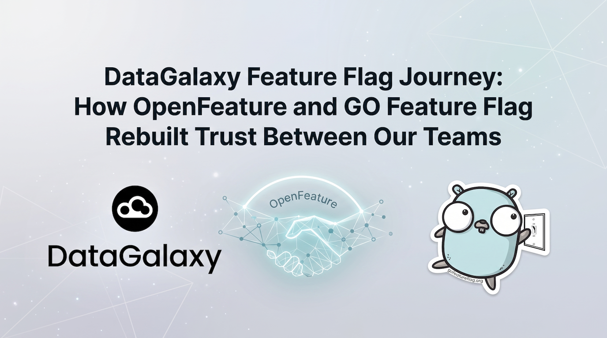

import {BeforeDiagram, AfterDiagram} from './diagrams';



:::info A note from GO Feature Flag

We are delighted to welcome **Tom Flenner, Staff Engineer at DataGalaxy**, as a guest contributor to the GO Feature Flag blog.

Drawing on his firsthand experience, Tom shares why DataGalaxy adopted GO Feature Flag, how the team integrated it across the company, and what they learned along the way.

:::

A few years ago, a fairly ordinary question would derail a fairly ordinary meeting at [DataGalaxy](https://www.datagalaxy.com/): **"is this feature actually live for this customer?"**  
Nobody in the room could answer it with confidence. The backend engineer would check a database table. The frontend engineer would check a build-time environment variable that may or may not have shipped in the last release. Someone from infra would mention an ingress rule nobody had touched in months. Three answers, three systems, and no way to know which one was telling the truth.

That meeting, repeated in different forms often enough to become a running joke, is really where this story starts. This is the story of how we went from that mess to a single, open, standardized way of answering that question, using [OpenFeature](https://openfeature.dev) as the contract and [GO Feature Flag](https://gofeatureflag.org) as the engine underneath it. It's also the first in a series of articles we plan to write about what feature flags have changed for us, and about the parts of this journey we haven't figured out yet.

## A quick word on what a feature flag actually is

If you're already deep in flag tooling, feel free to skip ahead. But it's worth grounding this story in the idea itself, because the term gets used loosely.

A feature flag (also called a feature toggle) is a mechanism that lets you change your software's behavior without changing and redeploying its code. Martin Fowler's [Feature Toggles](https://martinfowler.com/articles/feature-toggles.html) article remains the best reference on the topic: it separates flags into categories (release toggles, experiment toggles, ops toggles, permission toggles) and makes an argument we'd underlined long before we could articulate it ourselves: a flag isn't just an `if` statement, it's a piece of infrastructure with its own lifecycle, and treating it otherwise is how you end up with the mess described above.

That framing matters, because for a long time, we weren't running "feature flags" in that sense. We were running scattered conditionals with delusions of grandeur.


<!-- truncate -->

## The mess we were actually living in

Here's what our flag landscape looked like before this migration, and it grew the way most accidental architecture grows: opportunistically, one pull request at a time, with no single person accountable for the whole picture.

- Some flags lived as rows in a SQL table, read at request time by the backend.
- Some lived as environment variables baked directly into backend deployments, so toggling one meant a redeploy.
- Frontend flags lived in an entirely separate set of build-time environment variables, with no relationship to the same-named flag on the backend.
- Infra-level toggles (feature gates in ingress rules, canary weights) were a third, unrelated mechanism again.

None of these systems talked to each other, which is why that meeting kept happening. The capability ceiling was low too: almost every flag we had was a boolean on/off switch. No percentage rollout, no user targeting, no kill switch with a blast radius smaller than "redeploy the whole service." Every new flag need got solved with more glue code: a SQL lookup helper here, a config-parsing wrapper there, a frontend context provider quietly duplicating logic that already existed on the backend. Individually, none of this glue code was hard to write. Collectively, it was the real cost: it multiplied every time we added a flag consumer, and nobody owned the pattern end to end.

<BeforeDiagram/>

<p class="text-xl italic font-semibold text-[color:var(--goff-main-title-color)] tracking-tight border-l-4 border-goff-500 pl-4">We didn't need a fourth flag system bolted onto the first three. We needed to stop building flag systems and start using one.</p>

## Meeting OpenFeature: a standard, not another vendor

When we set out to fix this, the obvious move was to shop for a commercial feature flag vendor and rewrite everything against their SDK. We looked, and we backed away from that path, and that decision is the part of this story most worth slowing down on.

OpenFeature is a CNCF specification for feature flag evaluation: a vendor-neutral API and SDK contract that any flag provider can implement. Your application code calls the OpenFeature API, a pluggable *provider* underneath does the actual evaluation, and your evaluation logic in .NET, Go, Node, or your frontend framework of choice gets written once against a stable interface. The provider, meaning the vendor, becomes a swappable implementation detail rather than the foundation your whole codebase is built on.

That distinction changed our calculus in a few concrete ways:

1. **No lock-in.** If a vendor's pricing changes, or their roadmap diverges from what we need, we swap the provider, not our application code. We're not staking years of engineering effort on one company's SDK design decisions.
2. **Multi-vendor by construction.** Different teams, or different environments, can run different providers behind the same API. Evaluating a migration doesn't require a rewrite, just a new provider configuration.
3. **A real specification, not a marketing page.** The OpenFeature spec defines evaluation semantics, targeting context shape, and error/fallback behavior precisely enough that SDKs across languages behave consistently. That consistency is what finally gave us one mental model for "how a flag evaluates," shared across backend, frontend, and infra.
4. **A genuinely open, technically strong community.** The CNCF working group behind OpenFeature includes engineers from multiple competing flag vendors and large adopters, all incentivized to keep the spec vendor-agnostic. That's an unusual alignment of interests for a standards body, and it shows in how carefully the spec handles edge cases: stale-value fallback, provider initialization states, structured error codes.

Picking a standard instead of a vendor felt, at the time, like the cautious choice. In hindsight, it was the choice that made everything downstream possible.

## Enter GO Feature Flag

A standard is only as good as the providers that implement it, and this is where GO Feature Flag enters the story properly, because it deserves more than a passing mention.

GO Feature Flag is an open source feature flag solution, distributed as a single Go binary, built around the idea that flag evaluation infrastructure doesn't need to be heavy to be capable. A few things stood out to us while evaluating it:

- **It's a single binary, and we don't even run it as a library.** We run the **RelayProxy**, GO Feature Flag's standalone HTTP service, so our .NET and frontend applications talk to it over plain HTTP/OpenFeature REST evaluation instead of embedding a Go library into non-Go runtimes.
- **Multiple retrievers, so we weren't forced into a new storage layer.** GO Feature Flag can read flag definitions from a local file, S3, GitHub, Kubernetes ConfigMaps, or a plain **HTTP retriever**. That last one is what let us plug it directly into a multitenant SaaS, which the next section covers.
- **Notifiers and exporters as first-class features, not an afterthought.** We get webhook notifications the moment a flag configuration changes, so the team knows immediately when something flips in production, and we get an evaluation exporter, giving us analytics on who hit which flag with what result, without bolting on a separate pipeline.
- **It speaks OpenFeature natively.** GO Feature Flag ships official OpenFeature providers, including a REST-based one built for the RelayProxy, so adopting it meant configuring an existing provider rather than writing custom integration glue.
- **The operational surface is refreshingly small.** No dedicated database cluster to run, no separate control-plane UI to license, no SDK version matrix to reconcile across a dozen vendor releases. The RelayProxy is one deployable, configured with plain YAML, and today it runs as a standard Kubernetes deployment in our clusters, calling out to a serverless function as its HTTP retriever, without any extra ceremony.
- **The documentation is genuinely good**, and every retriever, notifier, and exporter comes with a working example, which mattered when we were deciding whether to trust this as our single source of truth for flag evaluation across every component we own.
- **It's actively maintained, in the open.** Issues get triaged, releases ship regularly, and the roadmap is visible on GitHub rather than gated behind a sales call, which matters a great deal when you're about to make a project this central to your delivery pipeline.

Taken together, these are the reasons GO Feature Flag earned our trust, and it's why we want to say this plainly:

<blockquote class="text-xl italic font-semibold text-[color:var(--goff-main-title-color)] tracking-tight border-l-4 border-goff-500 pl-4">
    <p>if your organization is evaluating flag providers, GO Feature Flag deserves a serious look, not as "the free option," but as a well-engineered piece of infrastructure in its own right.</p>
</blockquote>


There's another dimension to this worth naming directly rather than mentioning in passing. GO Feature Flag is maintained by Thomas Poignant, previously at Adevinta and now at Gens de Confiance, and it's a genuine French open source success story. The project is well documented, the maintainer is responsive on GitHub issues, and the release cadence shows sustained engineering effort rather than a project that shipped once and went quiet. It's already trusted in demanding production environments well beyond our own, which is exactly the kind of track record you want before wiring something this central into your delivery pipeline. For us, adopting it mattered for reasons beyond sentiment too: it's a data sovereignty consideration (self-hostable, no mandatory foreign SaaS dependency for flag evaluation data), and it's a deliberate choice to route our trust and our production traffic toward a European open source maintainer rather than defaulting to whichever US vendor has the biggest marketing budget. This project deserves more audience and notoriety than it currently has, not as an underdog story, but as recognition of infrastructure that's already earned its place among production-grade tooling.

## What actually changed: one evaluation, everywhere

The concrete win, the one that justified the migration cost on its own, was synchronization. Here's roughly what our provider setup looks like now on the .NET side, talking to the RelayProxy over HTTP:

```csharp title=".NET"
using OpenFeature;
using OpenFeature.Contrib.Providers.GOFeatureFlag;

var options = new GoFeatureFlagProviderOptions
{
    Endpoint = "https://relay-proxy.internal.com",
};

await Api.Instance.SetProviderAsync(new GoFeatureFlagProvider(options));

var client = Api.Instance.GetClient();

var evalContext = EvaluationContext.Builder()
    .SetTargetingKey("customer-1234")
    .Set("plan", "enterprise")
    .Set("region", "eu-west")
    .Build();

var enabled = await client.GetBooleanValueAsync("new-checkout-flow", false, evalContext);

if (enabled)
{
    // serve the new flow
}
```

And here's the same evaluation on the frontend, in Angular/TypeScript, against the same RelayProxy:

```typescript title="Angular / TypeScript"
import { OpenFeature } from '@openfeature/web-sdk';
import { GoFeatureFlagWebProvider } from '@openfeature/go-feature-flag-web-provider';

await OpenFeature.setProviderAndWait(
  new GoFeatureFlagWebProvider({
    endpoint: 'https://relay-proxy.internal.com',
  }),
);

const client = OpenFeature.getClient();

const context = {
  targetingKey: 'customer-1234',
  plan: 'enterprise',
  region: 'eu-west',
};

const enabled = await client.getBooleanValue('new-checkout-flow', false, context);

if (enabled) {
  // serve the new flow
}
```

Side by side, the shape is deliberately almost identical: set a provider, get a client, build an evaluation context, call `getBooleanValue`. That's not a coincidence, it's the entire point of OpenFeature as a standard. Two teams, two languages, two runtimes with nothing else in common, and the mental model for "how do I check a flag" is the same conversation either way. That's also a real credit to GO Feature Flag specifically: shipping first-party providers for both worlds, backend and frontend, server and browser, rather than treating one SDK as the primary target and the rest as an afterthought, is a huge plus, and it's a big part of why we could roll this out across the whole stack without asking every team to learn a different tool.

<AfterDiagram/>

The frontend, the .NET backend, and any infra-level check that also speaks OpenFeature now evaluate `new-checkout-flow` against the same targeting rules, the same rollout percentage, the same kill switch, at the same time, all routed through the same RelayProxy instance. Before, that sentence would have required three separate systems to agree by coincidence. Now it's simply a property of the architecture.

## Solving multitenancy with a thin abstraction layer

One detail we've glossed over so far: GO Feature Flag needs its flag configuration from somewhere, and in a multitenant SaaS, "somewhere" isn't a static YAML file someone edits by hand.

We built a small set of serverless functions, exposed to the RelayProxy as its HTTP retriever, that generate GO Feature Flag's configuration dynamically, sourced from our Customer Management System, our internal SaaS tooling for managing customers, instances, and deployments/releases. When someone changes a customer's plan, enables a feature for a specific instance, or provisions a new deployment through our internal UI, that change is synced into the database our CMS already manages. On the next retrieval, the RelayProxy calls our HTTP retriever, which turns that CMS state into the flag configuration GO Feature Flag actually evaluates against.

In practice, this means our internal UI *is* the flag admin panel for customers and instances, without anyone touching GO Feature Flag's configuration format directly, and without a separate system of record for "which customer has which flag" competing with the CMS we already trust. It's a thin layer on purpose: today the HTTP retriever just projects CMS state into GO Feature Flag config on each pull. There's a deeper article to write about the tradeoffs of that generation step (the refresh interval and staleness window, validation before serving, per-tenant targeting rule explosion), but that's a story for another day.

## The gain we didn't expect: trunk-based development, for real this time

Somewhere along the way, a gain arrived that wasn't on the original migration plan. Having a reliable, synchronized kill switch across the whole stack is what let us actually move to trunk-based development, instead of leaving it as a permanent item on a roadmap slide.

Engineers merge incomplete work behind a flag, ship it to production continuously, and get real feedback on code that isn't fully "done," instead of maintaining long-lived feature branches that rot the longer they stay open. That single change reshaped our delivery loop: fewer merge conflicts, shorter-lived branches, and a much tighter gap between writing code and learning whether it actually works in production. None of that was realistic when flipping a flag meant redeploying three different systems and hoping they agreed with each other.

## The door we've opened, but haven't fully walked through

Beyond trunk-based development, moving to a real flag evaluation engine unlocked capabilities we simply didn't have before, and that we haven't fully put to work yet:

- **A/B testing**, with consistent bucketing driven by evaluation context rather than a hand-rolled hashing function duplicated in two languages.
- **Canary releases**, where a flag's rollout percentage becomes the release mechanism, decoupled from deployment.
- **Kill switches** that actually work in seconds, not "redeploy and hope," because the flag source is queried live rather than compiled into a build.

We haven't built out most of this yet. Right now we're using GO Feature Flag mostly as a better on/off switch with real synchronization, which was already worth the migration on its own, on top of the trunk-based workflow it enabled. The targeting rules, percentage rollouts, and exporter-driven experimentation are the next phase, and they're a large part of why this is the first article in a series rather than a closed case study.

## Where this story goes next

Adopting a flag evaluation platform turned out to be the easy part. The harder part is organizational, and we're only starting to feel its edges:

- **Feature flag lifecycle management**: flags that outlive their purpose become permanent branches in your code that nobody remembers the reason for. We need a process for retiring flags, not just creating them.
- **Flag ops and feature-flag-driven development**: treating flag changes with the same rigor as deploys, meaning who can flip what, in which environment, with what audit trail. This is close to what's discussed in [Feature Flag Driven Development](https://www.youtube.com/watch?v=YjAgUlhBV90), and it's a topic we'll dig into on its own.
- **Dead code and ownership**: every flag is a fork in your code paths, and every fork needs an owner or it rots.
- **Feature flags versus entitlements**: a flag that gates a paid feature is not the same concept as a flag that gates a canary rollout, even though both can be implemented with the same primitive, and conflating them is a design mistake we want to avoid repeating.
- **Change management for the engineering org**: once you can ship code that isn't finished, or kill a feature in production in seconds, your whole mental model of "what does merged mean" and "what does deployed mean" has to change, and that's a culture shift, not a config change.

Each of those deserves its own article, including a deeper look at the CMS-driven configuration layer mentioned above. This one was about the foundation: why we chose an open standard over a proprietary SDK, why GO Feature Flag's RelayProxy and HTTP retriever were the right engine for that standard, and why finally synchronizing evaluation across our whole stack was worth the effort on its own, before we've even touched most of what it makes possible.

*This is the first article in a series on feature flags at DataGalaxy. If you're evaluating OpenFeature or GO Feature Flag for your own stack, or you're further along than we are on flag lifecycle management, flag ops, or the SDLC changes that come with trunk-based development, I'd love to hear from you.*

:::info Connect with Tom

Continue the conversation with Tom and follow his work:

- [LinkedIn](https://www.linkedin.com/in/tom-flenner/)
- [GitHub](https://github.com/tomflenner)
- [Medium](https://medium.com/@flennertom)

**Read the next article in the series directly on the [DataGalaxy Blog](https://www.datagalaxy.com/en/blog/)**

:::
