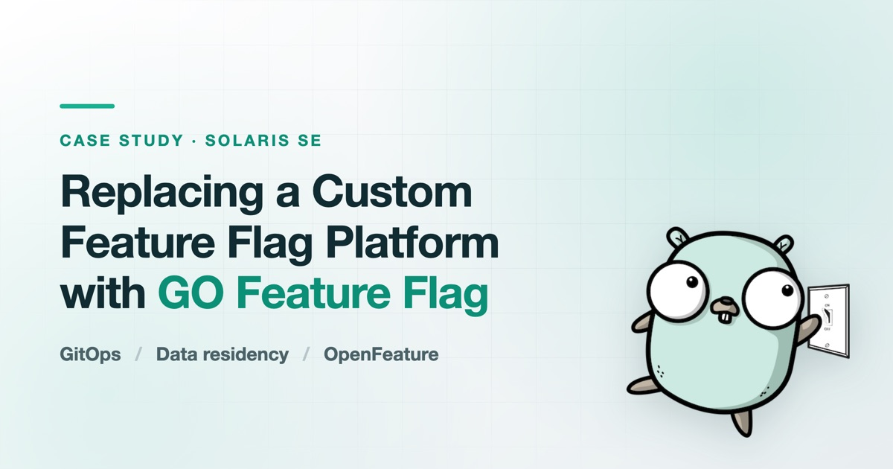
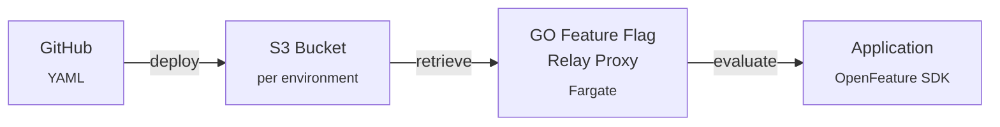
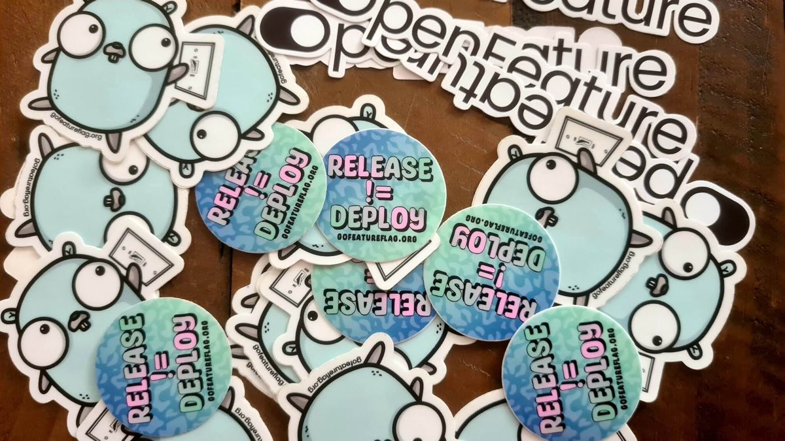

:::info A note from GO Feature Flag

We are happy to welcome **Olivier Laviale** as a guest contributor to the GO Feature Flag blog.

Olivier led the initiative to replace the in-house feature flag platform at [Solaris SE](https://www.solarisgroup.com/), a German Banking-as-a-Service provider. Below, he walks through the constraints that shaped the search, the seven tools he weighed, and why the team landed on GO Feature Flag — including the rough edges he hit and fixed on the way in.

:::

Separating deployment from release is basic hygiene for a modern engineering organisation. For a Banking-as-a-Service provider, it stops being hygiene and becomes a requirement: when a new feature does not behave the way it was supposed to, we need to switch it off immediately, not schedule a rollback.

Our in-house feature flag solution served us well for a long time. It was straightforward, it did what it was built to do, and for basic on/off features it was entirely adequate. What it was not was something that could grow with us. This is the story of how we chose its replacement.

## A quick primer, for anyone who needs it

If you already live in flag tooling, skip ahead.

Before feature flags, a bad bug meant rolling back the entire deployment. On a large monolith, that is not a button you press — it is a process, and it can take hours while the problem stays live in production.

A feature flag turns that into a switch. You toggle functionality in production, instantly, with no redeployment. That is the whole idea, and everything else is refinement on top of it.

<!-- truncate -->

## Where our own system ran out of room

The original platform stored toggles in a database. That model was fine while every flag was a boolean that applied to everybody, and for a long time every flag was exactly that.

As Solaris grew, two needs arrived that the binary model simply could not express:

- **Enabling a feature for one partner, or for internal testers only.** Not "on" or "off", but "on for these specific people".
- **Running A/B tests**, so we could measure whether a change actually did what we hoped before rolling it out to everyone.

Neither is exotic. Both were out of reach without rebuilding the thing, and rebuilding it would have meant maintaining a feature flag platform as a side project forever.

## The four requirements that decided it

Before looking at a single product page, we wrote down what a replacement had to satisfy. These were not preferences; they were the filter.

### 1. Security and data residency

We are a German FinTech. Data residency is a legal requirement, not an architectural preference. User data and the context we evaluate flags against has to stay in Germany, or at minimum inside the EU.

This alone eliminated most SaaS-only vendors. Shipping sensitive evaluation data outside our own infrastructure was never going to clear compliance, and no amount of feature richness was going to change that conversation.

### 2. Budget

We had no budget for new external tooling. That ruled out the premium enterprise tiers.

I want to be precise about this, because it is easy to read a constraint as a criticism. I have used Optimizely at HelloFresh and Split at Personio, and both are good products. They were not affordable for us here. That is a statement about our budget, not about their engineering.

### 3. GitOps first

This was a deliberate decision rather than an inherited one: we wanted flags out of a database and into configuration as code.

The reasoning is that a flag change is a production change. If it lives in a Git repository, it gets a pull request, a reviewer, a version history and an audit trail — the same treatment as the rest of our banking logic. If it lives in a database behind a web UI, it gets none of that by default.

### 4. No vendor lock-in

We had limited time to evaluate, which is exactly the situation in which you make an expensive long-term commitment by accident. [OpenFeature](https://openfeature.dev/) compatibility was our insurance policy: an open specification for flag evaluation means our application code targets a standard interface, and the provider underneath becomes something we can swap with modest effort rather than a foundation we are married to.

If we chose wrong, we wanted the cost of being wrong to be small.

## What we evaluated, and how it went

We looked at seven: LaunchDarkly, Optimizely, Split.io, Flagsmith, Unleash, GrowthBook and Flipt.

| Solution                        | Strength                | Why it didn't fit (at the time)                                                  |
| ------------------------------- | ----------------------- | -------------------------------------------------------------------------------- |
| LaunchDarkly, Split, Optimizely | Feature-rich, best UI   | Too expensive, and SaaS-only doesn't work for our data residency rules.          |
| Unleash, Flagsmith              | Robust, Open Source     | Required managing extra databases and infrastructure we didn't want to maintain. |
| GrowthBook                      | Excellent for Analytics | Too focused on A/B testing; we wanted a GitOps-first workflow.                   |
| Flipt                           | High performance        | GitOps support wasn't quite there yet compared to our winner.                    |

The "at the time" in that last column is doing real work. This was a snapshot of a moving field, evaluated against our particular constraints. A team with a budget and no residency rules would reasonably reach a different answer.

## Why GO Feature Flag won

We took the recommendation to our Principal Engineering group, who signed off on [GO Feature Flag](https://gofeatureflag.org/) as the sweet spot between power and simplicity. Four things earned it that description:

- **GitOps native, with no database.** Flags are YAML files in GitHub, deployed to S3. They pass through the same pull request reviews and the same deployment pipelines as our application code. There is no separate system of record and no second place to look.
- **Granular targeting.** Complex rules against user ID, region, or any custom attribute we care to pass in — which is precisely what the old boolean-in-a-table model could not do.
- **Integrations that fit what we already ran.** Custom retrievers pull configuration from S3 and GitHub; exporters push metrics to Prometheus. It slotted into our existing observability stack on day one instead of asking us to adopt a parallel one.
- **Lightweight and open source.** A Go binary in a Docker container, running on AWS Fargate, using very few resources.

  No database to run, no control plane to license, no second source of truth to
  reconcile. For a team with no budget and a compliance department, that
  combination is worth more than a better dashboard.

## Friction, and what I did about it

It would be a poor case study if I only described the parts that went well.

During the proof of concept I ran into a series of rough edges, mostly in documentation that had drifted behind the code. Rather than work around them, I fixed them:

- An incorrect volume mapping in the Docker setup ([#4618](https://github.com/thomaspoignant/go-feature-flag/pull/4618)).
- A broken Ruby SDK example using `import` where it needed `require` ([#4624](https://github.com/thomaspoignant/go-feature-flag/pull/4624)).
- A JavaScript SDK example that failed silently because the provider was never awaited before flags were evaluated ([#4625](https://github.com/thomaspoignant/go-feature-flag/pull/4625)).

Two more went in as issues: a `targetingKey` mapping problem in the JavaScript SDK that made targeting rules fail without saying so ([#4629](https://github.com/thomaspoignant/go-feature-flag/issues/4629)), and a configuration bug that made it impossible to configure the application through environment variables alone ([#4697](https://github.com/thomaspoignant/go-feature-flag/issues/4697)) — a must-have for our Fargate setup.

The biggest blocker was our WAF, which rejects any request arriving without a `User-Agent` header. The providers had no way to set one. So I added `CustomHeaders` support across three of them:

- Go — [go-sdk-contrib#831](https://github.com/open-feature/go-sdk-contrib/pull/831)
- JavaScript — [js-sdk-contrib#1465](https://github.com/open-feature/js-sdk-contrib/pull/1465)
- Swift — [openfeature-swift-provider#21](https://github.com/go-feature-flag/openfeature-swift-provider/pull/21)

What made all of this workable was the maintainers. Reviews came back quickly, merges followed, and the contributions landed instead of ageing in a queue.

<blockquote class="text-xl italic font-semibold text-[color:var(--goff-main-title-color)] tracking-tight border-l-4 border-goff-500 pl-4">
  

    When you are betting production infrastructure on an open source project, an
    active maintainer team is a requirement, not a luxury.
  

</blockquote>

Honestly, it was fun. And a few weeks later an envelope of GO Feature Flag stickers turned up in the mail, which is not a selection criterion, but it did not hurt.

## Getting people to actually use it

Choosing the tool is the part that looks like the work. It isn't.

A platform nobody adopts is a platform nobody adopts, however good the evaluation was. So I wrote reference implementations for every language in our stack — Go, Ruby, Java, Kotlin, Swift and JavaScript — so that no team's first question was "but how does this work in _our_ service?"

Documentation alone doesn't move people either. I ran deep-dive sessions with the Principal Engineering group and with team leads, then made myself available for 1:1s and pair programming. Most of the real adoption happened in those conversations rather than in anything I wrote down.

## What I'd tell you if you're doing this now

This was never only a swap of one toggle system for another. Insisting on OpenFeature and GitOps at the start is what produced a workflow that matches how Solaris actually ships code, rather than one the team would have had to work around. We can target features precisely, the banking platform stays stable, and developers are not slowed down to get either.

If you are evaluating feature flag tools, my advice is to ignore the dashboard for a moment. It is the most visible part of every product and the least important one. Instead:

- Work out how the tool fits your existing deployment pipeline.
- Check it against your compliance rules before you fall in love with it.
- Make sure you can leave.

:::info Connect with Olivier

Continue the conversation with Olivier and follow his work:

- [GitHub](https://github.com/olvlvl)
- [LinkedIn](https://www.linkedin.com/in/olvlvl/)
- [Blog](https://olvlvl.com/)

**This article originally appeared on [Olivier's blog](https://olvlvl.com/2026-03-solaris-feature-flag.html).**

:::
