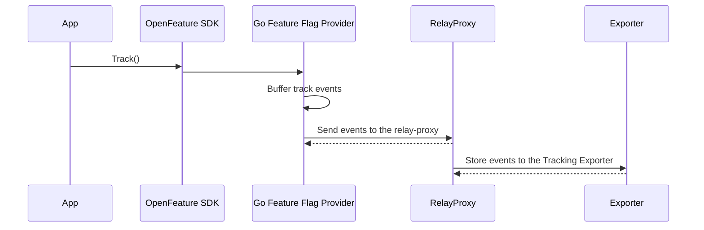

# 🎯 Tracking API

## What it is

The **OpenFeature Tracking API** lets you record custom actions or outcomes in your app (e.g. "user visited promo page," "user completed checkout with amount 99.99") and associate them with the same user or context you use for flag evaluation.
This follows the [OpenFeature Tracking specification](https://openfeature.dev/specification/sections/tracking/).

You call something like `client.track("event-name", context, details)` when the action happens in your application.

## Why use it

- **Measure the impact of flags**: For example, did users who saw the new button (flag on) actually click it more? By recording both "which variation they saw" ([flag usage](./flag-usage-tracking)) and "what they did" (tracking events), you can analyze conversion, revenue, or any metric per variation.
- **Experimentation**: Tracking is the "outcome" side of experimentation—you need both exposures and outcomes to run A/B tests or analyze feature impact.

## Concepts

- **Event name**: A string you choose (e.g. `"clicked-checkout"`, `"visited-promo-page"`).
- **Context**: The same evaluation context (user key, attributes) you use for flag evaluation, so tracking events can be joined with flag exposures in your analytics.
- **Details**: Optional extra data—for example a numeric **value** (e.g. order total) and/or custom fields (e.g. currency, item IDs). Useful for revenue, scores, or any structured payload your analytics expect.

## How it works

### With the relay-proxy and SDKs

Your app uses an OpenFeature client (e.g. Kotlin, JavaScript).

When you call `client.track(...)`, the provider records the event and later sends it in a batch to the relay's data collector.
The relay-proxy then forwards those events to the **tracking** exporters you configured.

Flow:



The relay-proxy never calls `track` itself; it only receives and forwards tracking events from SDKs.

### Summary

The Tracking API means: _record a named action or outcome for this user/context and optional details._ Events flow from your app (via the SDK) to the relay-proxy, then to the exporters you set up for tracking.

## What you need to do

1. **Call the OpenFeature track API** where the action or outcome occurs in your application (using the client provided by your OpenFeature SDK).
2. **Configure at least one exporter for tracking events**: Use a new exporter with the option `eventType: "tracking"` set, so the relay-proxy sends these events to that exporter. See [export evaluation data](../integrations/export-evaluation-data) and the relay-proxy configuration for how to add an exporter with `eventType: "tracking"`.

You can send tracking and flag-usage events to the same backend by defining two exporter entries (one for feature events, one for tracking events) if your pipeline accepts both.

## Event format

Each tracking event has the following structure when sent to your exporters:

| Field                    | Description                                                                                                                                                                                                                                                 |
| ------------------------ | ----------------------------------------------------------------------------------------------------------------------------------------------------------------------------------------------------------------------------------------------------------- |
| **kind**                 | Always `"tracking"` for custom tracking events.                                                                                                                                                                                                             |
| **contextKind**          | `"user"` for a known user, or `"anonymousUser"` for an anonymous context.                                                                                                                                                                                   |
| **userKey**              | The targeting key (user or entity identifier) from the evaluation context.                                                                                                                                                                                  |
| **creationDate**         | Unix timestamp (seconds) when the event was recorded.                                                                                                                                                                                                       |
| **key**                  | The tracking event name you passed (e.g. `"clicked-checkout"`).                                                                                                                                                                                             |
| **evaluationContext**    | The evaluation context (attributes, key) used when tracking, so you can join with flag exposures.                                                                                                                                                           |
| **trackingEventDetails** | Optional data: a numeric **value** and/or custom key–value fields. Keys are strings; values can be boolean, string, number, or nested structure, as per the [OpenFeature Tracking specification](https://openfeature.dev/specification/sections/tracking/). |

### Example

A minimal tracking event in JSON:

```json
{
  "kind": "tracking",
  "contextKind": "user",
  "userKey": "94a25909-20d8-40cc-8500-fee99b569345",
  "creationDate": 1618909178,
  "key": "clicked-checkout",
  "evaluationContext": {
    "targetingKey": "94a25909-20d8-40cc-8500-fee99b569345",
    "email": "user@example.com"
  },
  "trackingEventDetails": {
    "value": 99.77,
    "currencyCode": "USD"
  }
}
```

For the exact types and semantics of tracking event details (e.g. `value` and custom fields), see the [OpenFeature Tracking specification](https://openfeature.dev/specification/sections/tracking/).
