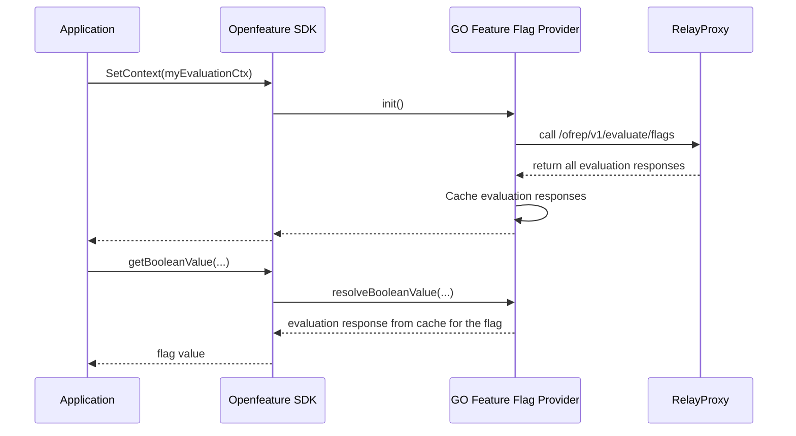

# Flag sets

|                      |                                                   |
|----------------------|---------------------------------------------------|
| **Creation Date**    | 27/10/2024                                        |
| **Last Update Date** | 27/10/2024                                        |
| **Authors**          | Thomas Poignant                                   |
| **Status**           |  |

## Definition

> A collection of related flags. This grouping helps organize feature flags based on their intended use, facilitating easier management and deployment.  
> _Source: [Openfeature glossary](https://openfeature.dev/specification/glossary/#flag-set)._


## Context

GO Feature Flag is supporting both flag evaluation for client and server-side.  
While the server side evaluations are evaluating flags 1 by 1, the client-side providers are evaluating flags in bulk.
The main reason why client are evaluating flags in bulk is because in the client-side the evaluation context is not changing
for every evaluation, so in order to limit the number of requests to the relay proxy, we are evaluating flags in bulk and keeping
them in memory inside the different client providers _(`web`, `iOS` and `android`)_ for OpenFeature.

### Sequence diagram of a client-side evaluation


:::note
For simplicity, we are not showing the cache mechanism in the sequence diagram, and how the cache is updated in case of flag configuration changes.
:::

### Why introducing flag sets?

As of today, in the client-side paradigm, we are evaluating all the flags available in GO Feature Flag based on the received evaluation context.
This means that we are evaluating all the flags available in the project, but in some cases, we might want to evaluate only a subset of the flags.

**When do we want to use flag sets?**
- We have multiple teams using the same GO Feature Flag instance, and we want to separate the flags evaluated by each team.
- We have different platforms using GO Feature Flag, and we want to limit which flags are evaluated by each platform.
- We want to give access to a list of flags to a specific user group.
- We want to allow 2 flags with the same name if they are used by different teams or platforms.

**For all those points, as of today the only way to achieve this is to run multiple instances of GO Feature Flag, which is not ideal.**

## Requirements

- A flag can be part of only 1 flag set.
- Flag name are unique within a flag set, but not across flag sets.
- GO Feature Flag should have a `default` flag set for users not using the flag sets feature _(the behaviours should be exactly the same as of today if the feature is not used)_.
- When calling the bulk evaluation APIs (`/ofrep/v1/evaluate/flags` or `/v1/allflags`), we will determine which flag set to evaluate based on API key used.
- The bulk evaluation APIs should evaluate only 1 flag set at a time _(to avoid collision in flag names)_.
- It should be able to specify which flag set to evaluate when calling the evaluation APIs. _(e.g. `/ofrep/v1/evaluate/flags` or `/ofrep/v1/evaluate/flags/{flag_key}`)_.
  - Ideally we should be able to know which flag set to used based on the API Key used.
  - If GOFF is configured to be public, we should be able to specify the flag set to evaluate in the request _(with a specific header ex:`goff-flag-set`)_.
  - In the providers, we should be able to specify the flag set to evaluate directly in the constructor _(by providing an API Key, or the name of the flag set)_.
- Admin API Keys, should be able to evaluate all the flag sets _(to be able to see all the flags available in the project)_. If none specified in the request, the default flag set should be evaluated.


## Out of scope for now
- Dynamic flag sets based on the evaluation context _([as mentioned in this slack message](https://gophers.slack.com/archives/C029TH8KDFG/p1732703075509229))_.
- Single retrievers for multiple flag sets _(as proposed in https://github.com/thomaspoignant/go-feature-flag/issues/2314)_.

_Even if out of scope for now, those are interesting options that we may want to implement later._

## Proposed solution

### Solution 1: 1 flag set per file

In this solution we consider that we need at least one file per flag set.  
All the flags retrieved by a `retriever` _(aka in the same file)_ will be associated to the same flag set.

We can specify the flag set name in the configuration file.  
As of today, we can still have multiple files for 1 flag set _(by specifying the same `flagSet` name in each file)_,
and we will have the same mechanism as of today _(with flag overridden in case of flag name collision)_.

#### Flags configuration file
```yaml
# config-file1.goff.yaml
# Syntax used in this example is just for the sake of the example, it is not the final syntax.
flagSet: flagset-teamA

featureA-enabled:
  variations:
      enabled: true
      disabled: false
  defaultRule:
    variation: enabled
```
```yaml
# config-file2.goff.yaml
flagSet: flagset-teamB

featureA-enabled:
  variations:
      enabled: true
      disabled: false
  defaultRule:
    variation: enabled
```

#### Relay-proxy configuration example
```yaml
# ...
retrievers:
  - kind: file
    path: config-file1.goff.yaml
  - kind: file
    path: config-file2.goff.yaml

authorizedKeys:
  evaluation:
    - apikey1 # owner: userID1
    - apikey2 # owner: userID2
  admin:
    - apikey3
```

**PRO**
- It is simple to configure a flag set by putting all the flags at the same place.
- It is easy to understand which flags are part of a flag set.
- It is easy to give ownership of a flag set to a team, by giving them access to the file.

**CON**
- The flag set configuration is at the same place as the flag configuration, so it is possible to edit the flag set name directly inside the file _(risk of overriding another flag set)_.
- If we want the same flag to be part of multiple flag sets, we need to duplicate the flag in multiple files.

### Solution 2: specify the flag set in the retriever configuration

In this solution we consider that we need at least one file per flag set.  
All the flags retrieved by a `retriever` _(aka in the same file)_ will be associated to the same flag set.

We associate the flag set to the retriever in the configuration,
#### Flags configuration file
```yaml
# config-file1.goff.yaml
featureA-enabled:
  variations:
      enabled: true
      disabled: false
  defaultRule:
    variation: enabled
```
```yaml
# config-file2.goff.yaml
featureA-enabled:
  variations:
      enabled: true
      disabled: false
  defaultRule:
    variation: enabled
```

#### Relay-proxy configuration example
```yaml
# ...
retrievers:
  - kind: file
    path: config-file1.goff.yaml
    flagSet: flagset-teamA
  - kind: file
    path: config-file2.goff.yaml
    flagSet: flagset-teamB

authorizedKeys:
  evaluation:
    - apikey1 # owner: userID1
    - apikey2 # owner: userID2
  admin:
    - apikey3
```

**PRO**
- It is simple to configure a flag set by putting all the flags at the same place.
- It is easy to understand which flags are part of a flag set.
- It is easy to give ownership of a flag set to a team, by giving them access to the file.
- The flag set name is directly associated to the retriever, so it is not possible to edit it directly inside the file.

**CON**
- If we want the same flag to be part of multiple flag sets, we need to duplicate the flag in multiple files.

### Solution 3
:::note
Feel free to propose other solutions here.
:::

## Decision

## Consequences
