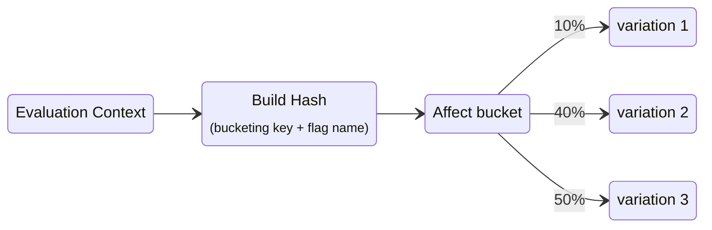

# 🪣 Custom Bucketing

## Overview
When it comes to splitting the affectation of a flag, the `targetingKey` is usually given a user ID. This key ensures that a user will always be in the same group for each flag.

But sometimes we want to be sure that a group of users will always be in the same group for each flag.
The `bucketingKey` field in the flag configuration allows you to define a different identifier to be used instead of the `targetingKey`.

This enables you to split users based on a custom identifier, such as a team ID, a company ID, or any other attribute that is common to multiple users.

## How it works

When evaluating flags, the `targetingKey` is used to build the hash that will allow GO Feature Flag to affect the user to a variation, if a `bucketingKey` is defined, it will be used instead of the `targetingKey`.



Since we are using an attribute that is common to multiple users at the same time, we can ensure that all users with the same attribute will always be in the same group.
 

:::warning
- If a value in the corresponding `bucketingKey` is not found in the **evaluation context**, the flag rules will not be evaluated, and the SDK will return the default value.
- Since the `bucketingKey` is not unique to a user, you can end up with a not uniform distribution of users in the variations depending on the repartition of the `bucketingKey` values.
:::

## Example: Split users based on their team ID
Let's say you want to rollout a new feature and be sure that all the members of the same team will receive the same variation.

To achieve this, you can define the `bucketingKey` to be the `teamId` in the flag configuration.

```yaml title="flag-config.goff.yaml"
scream-level-feature:
  # highlight-next-line
  bucketingKey: "teamId"
  variations:
    low: "whisper"
    medium: "talk"
    high: "scream"
  defaultRule:
    percentage:
      medium: 50
      high: 50
```

With this flag configuration, the `teamId` value will be used for hashing instead of `targetingKey`. The value must be provided to the evaluation context:

```go title="example.go"
evalCtx := openfeature.NewEvaluationContext(
    "user-123",
    map[string]interface{}{
        "teamId", "f74b72",
    },
)
boolValue, _ := client.BooleanValue("first-flag", false, evalCtx)
```

As a result, users who are members of the same team will receive the same flag variation, consistently.  
A different `bucketingKey` can be used per experiment, though normally you'll only have a handful of possible values.
